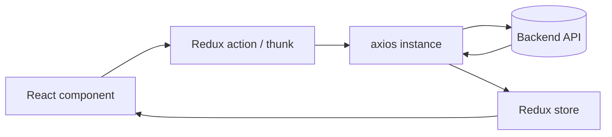

## 1. Overview

### 1.1. Призначення frontend-частини

Frontend `buero-frontend` — це **SPA на React + TypeScript**, яка реалізує:

- **Landing / Home**: презентація платформи, пояснення цінності, CTA на Placement Test / trial.
- **Onboarding & Placement Test**: запуск та проходження глобального Placement Test, показ результатів, активація trial.
- **Student dashboard**: огляд прогресу, доступ до курсів, триалу/підписки, CTA на наступний крок.
- **Courses learning experience**: перегляд каталогу курсів, перегляд сторінки курсу, проходження відео/квізів/сценаріїв, збереження прогресу та нотаток.
- **Profile & Settings**: сторінка профілю, мова інтерфейсу (EN/DE), timezone, avatar, базові налаштування.
- **Subscriptions & Billing**: інтеграція зі Stripe (Checkout, Customer Portal), відображення статусу підписки.
- **Lesson Requests**: створення/керування запитами на живий урок.

### 1.2. Використання бекенд-модулів

Фронтенд напряму інтегрується з такими backend-модулями (див. `docs/api-plan.md`, `docs/modules/*.md`):

- **Auth**: логін, реєстрація, refresh, logout; робота з cookie (`access_token`, `refresh_token`).
- **Users**: `GET/PATCH /api/users/me` — профіль поточного користувача; мова інтерфейсу, timezone, avatar.
- **Placement Test**: `GET /api/placement-test/questions`, `POST /api/placement-test/submit`, `POST /api/placement-test/confirm-trial`.
- **Courses**: `GET /api/courses`, `GET /api/courses/:id`, CRUD для вчителів.
- **Course Materials**: `GET /api/courses/:courseId/materials`, `GET /api/courses/:courseId/materials/:id`.
- **Progress & Quizzes**: `GET /api/progress/me`, `/api/courses/:courseId/progress`, `/api/quiz/attempts*`, `/complete`, `/recommended-next`.
- **Subscriptions & Billing**: `/api/subscriptions/checkout`, `/api/subscriptions/me`, `/api/subscriptions/portal`, `/api/payments/me`.
- **Lesson Requests**: `/api/lesson-requests*` для студентів і вчителів.

---

## 2. Tech Stack (Frontend)

### 2.1. Основа

- **React 18** (SPA) + **React Router** (v6+).
- **TypeScript** з жорсткою типізацією.
- **State management:** Redux Toolkit (`@reduxjs/toolkit`, `react-redux`).
- **Форми:** React Hook Form.
- **Validation:** Zod (переважно) або Yup, з інтеграцією через `@hookform/resolvers`.
- **HTTP-клієнт:** `axios`.
- **Styling:** Tailwind CSS (+ за потреби локальні CSS-модулі для складних layout’ів, але за замовчуванням Tailwind).
- **i18n:** `react-i18next` (словники EN/DE).
- **Тести:** Jest + React Testing Library; e2e — Playwright або Cypress (рекомендується Playwright).

### 2.2. TypeScript / tsconfig

Рекомендована конфігурація `tsconfig.json` (високий рівень):

- `"strict": true`
- `"target": "ESNext"`
- `"module": "ESNext"`
- `"moduleResolution": "bundler"` (для Vite/modern екосистеми)
- `"jsx": "react-jsx"`
- `"baseUrl": "./src"`
- **alias-и**:
  - `@/features/*` → `src/features/*`
  - `@/components/*` → `src/components/*`
  - `@/shared/*` → `src/shared/*`
  - `@/redux/*` → `src/redux/*`
  - `@/api/*` → `src/api/*`
  - `@/hooks/*` → `src/hooks/*`

### 2.3. State Management & Persist

- **Redux Toolkit store**:
  - slices для auth, user, placementTest, coursesCatalog, courseLearning, profile, subscriptions, lessonRequests, ui/loading.
- **Persist (redux-persist або аналог)**:
  - **зберігаємо в `localStorage`**:
    - невеликий snapshot користувача: `{ id, role, language, avatarUrl }`;
    - прості UI-прапорці (наприклад, чи показувати onboarding-хінти).
  - **не зберігаємо в localStorage**:
    - `access_token`, `refresh_token` (див. `.cursor/rules/frontend-patterns.mdc`: токени лише в cookie).
  - Токени читаються та оновлюються **бекендом через HttpOnly cookie**, фронтенд спирається на:
    - `withCredentials: true` в HTTP-клієнті;
    - результат `/auth/refresh` (успіх/фейл) як сигнал валідності сесії.

### 2.4. HTTP-клієнт (axios)

Один інстанс `axios` у `src/api/http.ts`:

- `baseURL`: конфігурований через env (`VITE_API_BASE_URL`).
- `withCredentials: true` — завжди, для роботи з cookie.
- **Request interceptor**:
  - додає заголовки `Accept-Language` (з `users.language` або i18n-поточна мова).
  - за потреби додає `Authorization: Bearer <accessToken>` якщо бекенд дозволяє дублювання токена в заголовку (але первинне джерело — cookie).
- **Response interceptor**:
  - при `401`:
    - один раз викликає `/auth/refresh` (через окремий HTTP-клієнт без циклічного перехоплення);
    - при успіху повторює оригінальний запит;
    - при невдачі:
      - диспатчить `auth/logout` (очистка Redux та persist);
      - редіректить на `/auth` або головну;
      - показує глобальний toast із повідомленням про завершення сесії.

### 2.5. Форми та валідація

- **React Hook Form**:
  - всі суттєві форми (login, register, placement answers submit, profile edit, account settings, lesson request, billing дані, нотатки) реалізуються через RHF.
- **Zod / Yup**:
  - Схеми зберігаються в `src/features/<feature>/validation.ts` або `schema.ts`.
  - Інтеграція через `zodResolver` / `yupResolver`.
  - TypeScript-типи форм виводяться з цих схем:
    - `export type LoginFormValues = z.infer<typeof loginSchema>;`

### 2.6. Стилі та Design Tokens

**Tailwind CSS** (рекомендовано):

- `tailwind.config.js`:
  - кастомні кольори бренду (`primary`, `secondary`, `accent`, `muted`, `background`, `foreground`).
  - шрифти (наприклад, `font-sans` на базі Inter/Roboto, `font-serif` для заголовків).
  - `spacing` шкала: кратна 4 (`4, 8, 12, 16, 20, 24, ...`).
  - `borderRadius`: `sm`, `md`, `lg`, `xl` (наприклад, `0.375rem`, `0.5rem`, `0.75rem`, `1rem`).
  - `boxShadow`: `sm`, `md`, `lg` для карток та модалок.

**Design tokens** (описом у цьому документі):

- **Колірна палітра (приклад)**:
  - `primary`: #1D4ED8 (насичений синій) — основні CTA.
  - `primary-foreground`: #FFFFFF.
  - `secondary`: #0EA5E9 (бірюзовий) — вторинні CTA.
  - `background`: #F9FAFB (світлий фон).
  - `muted`: #6B7280 (сірий текст).
  - `danger`: #DC2626 (помилки).
- **Типографіка**:
  - `font-sans`: Inter/Roboto, 14–16px базовий розмір.
  - Заголовки: `text-2xl`, `text-3xl` для hero; `text-xl` для секцій.
- **Радіуси та тіні**:
  - Карти: `rounded-xl`, `shadow-md`.
  - Плаваючі панелі/модалки: `rounded-2xl`, `shadow-lg`.

---

## 3. Folder Structure

Цільова структура `src/`:

```text
src/
  main.tsx
  App.tsx
  routes/
    layout.tsx
  pages/
    HomePage/
    AssessmentPage/
    ResultsPage/
    AuthPage/
    TrialDashboardPage/
    SubscribedDashboardPage/
    TeacherDirectoryPage/
    AccountSettingsPage/
    CoursesCatalogPage/
    CoursePage/
    UserProfilePage/
    NotFoundPage/
  features/
    auth/
    placement-test/
    courses-catalog/
    course-learning/
    profile/
    subscriptions/
    lesson-requests/
    progress-quizzes/
  components/
    layout/
    ui/
  redux/
    store.ts
    persistConfig.ts
    slices...
  hooks/
  helpers/
  styles/
  api/
  errors/
```

### 3.1. `src/main.tsx`

- Точка входу:
  - створює React root;
  - обгортає `App` у `Provider` (Redux), `BrowserRouter`, `I18nextProvider`, можливо, `ThemeProvider`.

Приклад (високорівневий):

```ts
createRoot(rootElement).render(
  <StrictMode>
    <Provider store={store}>
      <BrowserRouter>
        <App />
      </BrowserRouter>
    </Provider>
  </StrictMode>
);
```

### 3.2. `src/App.tsx`

- Відповідає за:
  - оголошення `Router` (через `createBrowserRouter` або `Routes`/`Route`);
  - підключення глобального `AppErrorBoundary`;
  - lazy-loading сторінок (`React.lazy`, `Suspense` або `createBrowserRouter` `lazy`).

### 3.3. `src/routes/layout.tsx`

- **LayoutShell**:
  - глобальний Header (logo, навігація, CTA, language switch).
  - Footer (copyright, links).
  - основна область `<main>` з `<Outlet />`.
  - виклик `fetchCurrentUser()`/`refreshSession()` при mount.
  - компонент глобального `Toaster` для notification’ів.

### 3.4. `src/pages/*`

- Папка на кожну сторінку:
  - `HomePage/HomePage.tsx`
  - `AssessmentPage/AssessmentPage.tsx`
  - `ResultsPage/ResultsPage.tsx`
  - `AuthPage/AuthPage.tsx`
  - `TrialDashboardPage/TrialDashboardPage.tsx`
  - `SubscribedDashboardPage/SubscribedDashboardPage.tsx`
  - `TeacherDirectoryPage/TeacherDirectoryPage.tsx`
  - `AccountSettingsPage/AccountSettingsPage.tsx`
  - `CoursesCatalogPage/CoursesCatalogPage.tsx`
  - `CoursePage/CoursePage.tsx`
  - `UserProfilePage/UserProfilePage.tsx`
  - `NotFoundPage/NotFoundPage.tsx`

Усередині:

- лише **page-level компоненти** (композиція feature-компонентів, layout та ui).
- стилізація — через Tailwind або, за потреби, локальний `.module.css` (але без бізнес-логіки).

### 3.5. `src/features/*`

**Feature-based** підхід:

- `src/features/auth/`
  - `components/` (`LoginForm`, `RegisterForm`, `ResetPasswordForm`).
  - `redux/` (`authSlice.ts`).
  - `api/` (`authApi.ts`).
  - `validation/` (`authSchemas.ts`).
- `src/features/placement-test/`
  - компоненти для проходження, прогрес-бар, summary.
- `src/features/courses-catalog/`
  - фільтри, список курсів, картки.
- `src/features/course-learning/`
  - sidebar, lesson content viewer, video/quiz/scenario renderers, notes.
- `src/features/profile/`
  - profile overview, avatar upload, profile forms.
- `src/features/subscriptions/`
  - subscription banners, статус, кнопки Checkout/Portal.
- `src/features/lesson-requests/`
  - форма створення запиту, списки для студента/вчителя.
- `src/features/progress-quizzes/`
  - компоненти відображення прогресу, progress bar, recommended-next widgets.

У features **не лежать**:

- глобальні layout (Header, Footer);
- базові UI-компоненти (buttons, inputs, modals).

### 3.6. `src/components/layout/*`

- `LayoutShell`, `Header`, `Footer`, `Sidebar` (якщо глобальний), `PageContainer`.
- Відповідальні за **структуру**, а не за бізнес-логіку.

Приклади:

- `Header/Header.tsx`
- `Footer/Footer.tsx`
- `LayoutShell/LayoutShell.tsx`

### 3.7. `src/components/ui/*`

- дрібні UI-компоненти, без знання про конкретні фічі:
  - `Button`, `Input`, `Select`, `Checkbox`, `RadioGroup`, `Tabs`, `Modal`, `Card`, `Skeleton`, `Badge`, `Avatar`, `ProgressBar`, `Toast` (якщо не зовнішня бібліотека).
- Skeleton-компоненти:
  - `CourseCardSkeleton`, `LessonSidebarSkeleton`, `ProfileOverviewSkeleton`.

### 3.8. `src/redux/*`

- `store.ts` — конфігурація Redux store.
- `persistConfig.ts` — конфіг `redux-persist` (whitelist/blacklist для slices).
- `slices/` або інтеграція slices з features.

Рекомендація:

- slices, специфічні для feature, розташовані в `src/features/<feature>/redux`.
- у `src/redux/rootReducer.ts` — імпорт slices з features.

### 3.9. `src/hooks/*`

- Кастомні hooks, що перевикористовуються:
  - `useAuthGuard`, `useCurrentUser`, `useSubscriptionStatus`.
  - `useMediaQuery`, `useDebounce`, `usePagination`.

### 3.10. `src/helpers/*`

- Утиліти:
  - `http.ts` (обгортки над axios, error mapping).
  - `formatters` (дати, рівні A1–B2).
  - `errorMapper`, `safeJsonParse`, `buildQueryString`.

### 3.11. `src/styles/*`

- Глобальні стилі Tailwind (`index.css` з `@tailwind base; @tailwind components; @tailwind utilities;`).
- Допоміжні CSS (якщо потрібні) — типографіка, layout-токени.

### 3.12. `src/api/*`

- Typed API-клієнти (thin wrappers над axios):
  - `authApi.ts`, `usersApi.ts`, `placementTestApi.ts`, `coursesApi.ts`, `materialsApi.ts`, `progressApi.ts`, `subscriptionsApi.ts`, `lessonRequestsApi.ts`.
- Кожен метод повертає **строго типізовані** DTO, узгоджені з backend.

### 3.13. `src/errors/*`

- `AppErrorBoundary.tsx` — глобальний Error Boundary.
- Локальні Error Boundaries:
  - `CoursePageErrorBoundary.tsx`, `ProfileErrorBoundary.tsx`, `CatalogErrorBoundary.tsx`.

---

## 4. Routing & Navigation

### 4.1. Таблиця роутів

| Route | Page | Role/Access | Опис | Guard | ErrorBoundary |
|-------|------|-------------|------|-------|---------------|
| `/` | `HomePage` | public | Landing, hero, benefits, CTA на assessment/trial. | — | Global |
| `/assessment` | `AssessmentPage` | authenticated (student) або public+soft-guard | Старт та проходження Placement Test. | AuthGuard (redirect на `/auth` або inline login modal) | PlacementTest boundary (локальний) |
| `/results` | `ResultsPage` | authenticated (student) | Показ рівня A1–B2, CTA на trial/dashboard/courses. | AuthGuard | Global |
| `/auth` | `AuthPage` | public | Login/Register/Reset. | Redirect, якщо вже logged-in (до `/dashboard/...`). | Global |
| `/dashboard/trial` | `TrialDashboardPage` | student with trial | Дашборд триалу: прогрес placement, CTA до першого курсу, banner trial. | ProtectedRoute + `requireTrial` | Dashboard boundary |
| `/dashboard/subscribed` | `SubscribedDashboardPage` | student with active subscription | Основний дашборд студента з курсами, прогресом. | ProtectedRoute + `requireActiveSubscription` | Dashboard boundary |
| `/teachers` | `TeacherDirectoryPage` | student/teacher (optional MVP) | Список вчителів, CTA на lesson request. | ProtectedRoute (optional) | Global |
| `/settings/account` | `AccountSettingsPage` | authenticated | Налаштування акаунту: мова, timezone, email (частково), password reset link. | ProtectedRoute | AccountSettings boundary |
| `/courses` | `CoursesCatalogPage` | student with trial/subscription | Каталог курсів з фільтрами, пошуком. | ProtectedRoute + `requireContentAccess` | Catalog boundary |
| `/courses/:courseId` | `CoursePage` | student with trial/subscription | Learning view: sidebar lessons, main content, progress. | ProtectedRoute + `requireContentAccess` | CoursePage boundary |
| `/profile` або `/me` | `UserProfilePage` | authenticated | Мій прогрес, курси, profile settings, avatar. | ProtectedRoute | Profile boundary |
| `*` | `NotFoundPage` | public | 404 з CTA на `/` або `/courses`. | — | Global |

### 4.2. ProtectedRoute / Guards

- **ProtectedRoute**:
  - читає `auth`/`currentUser` з Redux.
  - якщо користувач не завантажений → показує `Loader`.
  - якщо користувача немає → редірект на `/auth` (або `/` з login modal).
- **Access guards** (`requireTrial`, `requireActiveSubscription`, `requireContentAccess`):
  - перевіряють `subscriptions` slice та/або поле `trial_ends_at`.
  - при відсутності доступу:
    - редірект на `/dashboard/trial` або `/subscriptions` CTA.

### 4.3. Error Boundaries

- **Global `AppErrorBoundary`**:
  - обгортає `App` на кореневому рівні.
  - показує fallback-екран з CTA «Reload» / «Go Home».
- **Локальні Boundaries**:
  - `CoursePageErrorBoundary` — на `/courses/:courseId`.
  - `ProfileErrorBoundary` — на `/profile`.
  - `CatalogErrorBoundary` — на `/courses`.

---

## 5. State Management & Data Flow

### 5.1. Типовий цикл



### 5.2. Mini-flows

- **Login / Register**:
  - RHF-форма → `auth/login` thunk → `POST /auth/login` → бекенд встановлює `access_token`/`refresh_token` у HttpOnly cookie → frontend знову запитує `/api/users/me` → оновлює `auth`/`user` slices → редірект.
- **Refresh**:
  - при старті застосунку `Layout` викликає `fetchCurrentUser`:
    - `GET /api/users/me` з cookie → якщо 200 → оновлює `user` slice;
    - якщо 401 → axios-интерцептор запускає `/auth/refresh` → при успіху — повторення запиту, при фейлі — logout.
- **Logout**:
  - `POST /auth/logout` → бекенд прибирає/інвалідує cookie/refresh;
  - frontend чистить Redux/persist та редіректить на `/`.
- **My courses / progress**:
  - `GET /api/progress/me` та `GET /api/courses` / `GET /api/courses/:courseId/progress`;
  - прогрес зберігається в `progressQuizzes` slice.
- **Update profile / avatar**:
  - форми в `profile` feature → PATCH `/api/users/me` → оновлення slices.
- **Placement test**:
  - `GET /api/placement-test/questions` → локальний state + RHF.
  - `POST /api/placement-test/submit` → результат level, оновлення `user` slice.
  - `POST /api/placement-test/confirm-trial` → оновлення `subscriptions`/`user`.

### 5.3. Що де зберігаємо

- **Redux**:
  - `auth` (стан сесії, статуси login/logout/refresh).
  - `user` (поточний користувач, роль, language, timezone, avatar).
  - `coursesCatalog`, `courseLearning`, `progressQuizzes`, `subscriptions`, `lessonRequests`, `ui` (модалки, спіннери).
- **Persist (localStorage)**:
  - `user` snapshot (id, role, language, avatarUrl).
  - невеликі UI-прапорці.
- **Локальний state компонентів**:
  - поточна вкладка, відкриті акордеони, розгорнуті фільтри, стан форм до сабміту.

---

## 6. HTTP Client, Error Handling, Skeleton UX

### 6.1. Axios-інтерцептори та 401

- **Request**:
  - встановлює `withCredentials = true`.
  - додає `Accept-Language`.
- **Response**:
  - якщо `response.status === 401` і це **не** запит `/auth/login` чи `/auth/refresh`:
    - один раз пробує `POST /auth/refresh`.
    - при успіху — повторює оригінальний запит.
    - при помилці — викликає `auth/logout` + редірект.

### 6.2. Error handling

- **Технічні помилки**:
  - глобальний toast/notification (наприклад, `react-hot-toast`).
  - для критичних (неможливо завантажити CoursePage) — ErrorBoundary fallback.
- **Валідаційні помилки форм**:
  - бекенд повертає деталізовані помилки полів;
  - adapter у `helpers/http.ts` мапить їх у формат RHF (`setError`).

### 6.3. Skeleton UX

- **Loading стани** за `isLoading`/`isFetching` з Redux або `React Query` (якщо додамо).
- Skeleton-компоненти:
  - Landing hero skeleton (headline, кнопки).
  - Courses catalog skeleton (сітка карток).
  - Course page skeleton (sidebar list + main video/content placeholder).
  - Profile overview skeleton (cards з placeholders).

---

## 7. Auth Contract (Frontend)

Відповідає `.cursor/rules/frontend-patterns.mdc` та backend-специфікації:

- **Tokens in cookie only**:
  - `access_token`, `refresh_token` зберігаються **лише у HttpOnly cookie**.
  - **Не** записуємо токени в `localStorage` або інше JS-доступне сховище.
- **HTTP-клієнт**:
  - один axios-інстанс з `withCredentials: true`.
  - при 401 — спроба `/auth/refresh`, потім logout/redirect.
- **UI-стан авторизації**:
  - Redux зберігає факт наявності сесії та snapshot користувача.
  - Detect session: успішний `GET /api/users/me` → «logged in».

---

## 8. Forms, Validation, UX

### 8.1. Ключові форми

- Auth: login, register, (password reset — якщо буде у MVP).
- Placement test: відповіді на питання, підтвердження trial.
- Profile: оновлення імені (якщо є), language, timezone, avatar upload.
- Account settings: мова, timezone, email preferences.
- Lesson request: preferred_time, message.
- Notes та feedback у курсах (якщо є).

### 8.2. Патерн використання RHF + Zod

- Кожна форма:
  - має схему (`z.object({...})`) з:
    - обов’язковістю полів;
    - міндовжиною/максовою довжиною;
    - патернами (email, пароль).
  - використовує `useForm({ resolver: zodResolver(schema) })`.
  - інпут-компоненти приймають `error` проп для показу inline-помилок.

### 8.3. UX-поведінка

- **Errors**:
  - Показуються inline біля полів.
  - Для складних форм — також summary-панель вгорі.
- **Submit**:
  - кнопка дизейблиться при `isSubmitting`.
  - глобальний loading-spinner на критичних сабмітах (auth, placement submit).
- **Оптимізації**:
  - debounce для фільтрів каталогу курсів та пошуку.
  - autosave notes (через debounce + `PATCH /notes`).

---

## 9. i18n, A11y, Responsive

### 9.1. i18n

- `react-i18next`:
  - словники в `src/i18n/locales/en/*.json`, `de/*.json`.
  - ключі на рівні features: `auth.login.title`, `courses.catalog.title`.
- Вибір мови:
  - спочатку з `user.language` (якщо залогінений).
  - інакше — з `localStorage` або `navigator.language`.
  - оновлення мови в профілі → збереження на бекенді + у i18n.

### 9.2. A11y

- **ARIA-атрибути**, фокусні стилі, клавіатурна навігація:
  - всі інтерактивні елементи мають `role`/`aria-label` за потреби.
  - кнопки/лінки не реалізуються дивами без ролей.
- Для модалок:
  - фокус-трап;
  - `aria-modal="true"`, `role="dialog"`.

### 9.3. Responsive behaviour

Tailwind breakpoints (`sm`, `md`, `lg`, `xl`):

- **Landing**:
  - mobile: стек секцій, CTA завжди видимий.
  - desktop: двоколонковий hero (текст + ілюстрація/курс preview).
- **CoursesCatalog**:
  - `sm`: 1 картка в ряд.
  - `md`: 2 картки.
  - `lg+`: 3–4 картки.
- **CoursePage**:
  - desktop: ліворуч — fixed/sidebar з модулями/уроками; праворуч — контент.
  - mobile: sidebar як drawer/slide-over; основний контент фул-вширину.
- **Profile**:
  - карточки прогресу розкладаються в сітку, але на mobile — один стовпчик.

---

## 10. Git Workflow & Commits

- Див. `.cursor/rules/git-workflow.mdc` для загальних правил.

### 10.1. Гілки фронтенду

- Формат: `feature/TGIPR-<JIRA>/frontend-<short-description>`.
- Приклади:
  - `feature/TGIPR-101/frontend-landing-page`
  - `feature/TGIPR-102/frontend-courses-catalog`
  - `feature/TGIPR-103/frontend-course-learning-view`

### 10.2. Коміти

- Використовуємо conventional commits:
  - `feat: add courses catalog page`
  - `fix: handle 401 refresh failure`
  - `refactor: extract course sidebar component`
  - `chore: configure tailwind and eslint`

Коментарі та назви комітів — англійською; документація — українською з технічними термінами англійською.

