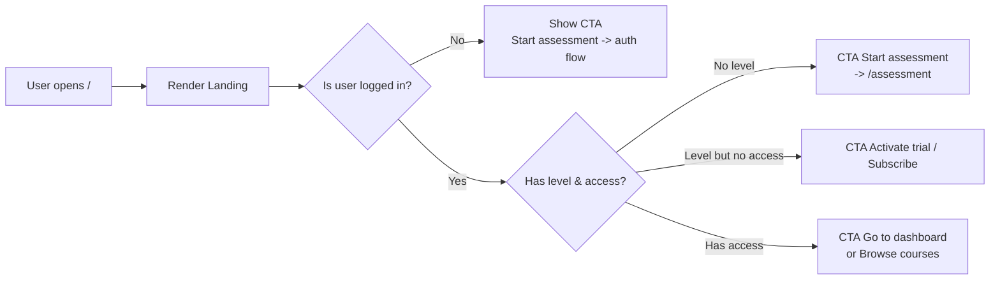

## 00. Landing / Home UI

### 1. Призначення feature

Landing (`/`, **HomePage**) — перша точка входу для нового користувача:

- пояснює цінність платформи;
- демонструє ключові benefits та метрики («Your progress always visible»);
- показує testimonials;
- веде до **Placement Test** та/або trial/підписки через чіткі CTA.

---

### 2. Сторінки та компоненти

#### 2.1. Сторінка

- `pages/HomePage/HomePage.tsx`

#### 2.2. Layout-компоненти

- `LayoutShell` (`routes/layout.tsx`) — глобальний shell з Header/Footer.
- `Header`:
  - logo, навігація (`Home`, `Courses`, `Dashboard`), language switch (EN/DE), auth-buttons (`Sign in` / `Get started`).
- `Footer`:
  - лінки на політику, контакти, соцмережі.

#### 2.3. Feature-компоненти

Папка `src/features/landing/`:

- `HeroSection`:
  - headline, subheadline, primary CTA (`Start assessment`), secondary CTA (`Browse courses`).
- `KeyBenefitsSection`:
  - 3–4 картки (наприклад: «Scenario-based learning», «Integration & Life in Germany», «Always visible progress»).
- `MetricsSection`:
  - візуалізація прогресу (streak, завершені модулі, середній час до результату).
- `TestimonialsSection`:
  - слайдер/грід з відгуками (можна конфігурований/статичний).
- `FinalCTASection`:
  - повтор primary CTA (assessment/trial) з коротким нагадуванням benefits.

#### 2.4. UI-компоненти

- `Button`, `Card`, `Badge`, `Avatar`, `Icon`, `SectionTitle`, `ResponsiveGrid`.
- Skeleton-версії:
  - `HeroSkeleton`, `MetricsSkeleton`, `TestimonialsSkeleton`.

---

### 3. State (Redux, local, persist)

#### 3.1. Redux

- Landing не потребує окремого slice; використовує:
  - `auth/user` для умовного рендеру CTA:
    - якщо гість → `Start assessment` відкриває auth-flow.
    - якщо студент без level → `Start assessment`.
    - якщо студент із level, але без trial/pідписки → `Go to dashboard`.
  - `subscriptions` — для показу банера (trial vs active subscription).

#### 3.2. Persist

- Нічого специфічного; landing не має власного persisting-стану.

#### 3.3. Локальний state

- анімації, expand/collapse, carousel-слайди, але не бізнес-дані.

---

### 4. Форми та валідація

Landing не містить критичних форм, окрім:

- підписка на newsletter (опційно) — RHF + проста email-валидація;
- прості контактні форми (якщо будуть).

У MVP ці форми можуть бути відсутні; основний фокус — CTA-кнопки, що ведуть у assessment/auth.

---

### 5. API

Landing у MVP може:

- працювати повністю статично (без API);
- або (опційно) підвантажувати:
  - testimonials з бекенду (якщо є окремий модуль);
  - агреговані метрики прогресу (наприклад, середній % завершення курсів) — **опційно**.

Конкретні endpoints для цих даних не визначені в backend-модулях, тому для MVP фронтенд може використовувати статичні дані/конфіг.

---

### 6. Error Handling & Skeletons

- **Skeletons**:
  - Якщо testimonials/метрики приходять з API:
    - `HeroSection` може рендеритись одразу (в основному статичний).
    - `MetricsSection`/`TestimonialsSection` показують skeleton, поки дані завантажуються.
- **Errors**:
  - Якщо помилка при завантаженні testimonials/metrics — fallback до статичного контенту або приховування секції.
  - Глобальний error-трекер не зупиняє рендер Landing.

Error Boundary окремо для Landing не потрібен; достатньо глобального `AppErrorBoundary`.

---

### 7. Mermaid-flow основного сценарію

