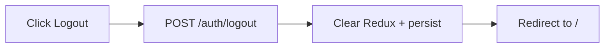

## 01. Auth UI

### 1. Призначення feature

Feature **Auth UI** відповідає за:

- логін / реєстрацію користувачів (student/teacher);
- опціональний reset password flow (якщо реалізується у MVP);
- керування станом сесії на фронтенді (без прямого доступу до токенів);
- інтеграцію з backend Auth-модулем (`docs/auth-spec.md`, `docs/modules`).

---

### 2. Сторінки та компоненти

#### 2.1. Сторінка

- `pages/AuthPage/AuthPage.tsx`:
  - таби/кнопки перемикання між `Login` і `Register`;
  - врізаний блок з формою та короткими benefits.

#### 2.2. Feature-компоненти (`src/features/auth/`)

- `LoginForm`:
  - поля: email, password.
  - CTA: «Sign in».
- `RegisterForm`:
  - поля: email, password, confirmPassword, role (student/teacher), language (en/de).
  - CTA: «Create account».
- (Опційно) `ResetPasswordRequestForm`, `ResetPasswordForm`.
- `AuthLayout` (внутрішній): картка з заголовком, описом, перемикачем видів форм.

#### 2.3. Layout/UI-компоненти

- `Modal` (для inline-auth з Landing/CoursePage).
- `Button`, `Input`, `PasswordInputWithToggle`, `FormField`, `Alert`.

---

### 3. State (Redux, persist)

#### 3.1. Redux slice: `auth`

Папка: `src/features/auth/redux/authSlice.ts`.

Приблизна структура:

- `isAuthenticated: boolean` (вивід з наявності поточного користувача).
- `status: 'idle' | 'loading' | 'error' | 'success'`.
- `error: string | null`.

Actions/Thunks:

- `login` (async thunk):
  - приймає креденшіали;
  - викликає `POST /auth/login`;
  - у випадку успіху робить `dispatch(fetchCurrentUser())` з Users feature;
  - on success — `isAuthenticated = true`.
- `register` (async thunk):
  - `POST /auth/register`;
  - аналогічно, далі `fetchCurrentUser()` або редірект на `/auth` для login.
- `logout` (async thunk):
  - `POST /auth/logout`.
  - очищає user/auth-слайси, persist, редіректить на `/`.

#### 3.2. Persist

- `auth` slice **може частково зберігатися** (наприклад `isAuthenticated`), але не містить жодних токенів.
- Основний «факт сесії» визначається по успішному `GET /api/users/me` при старті.

---

### 4. Форми та валідація

#### 4.1. Login

- RHF з Zod-схемою:
  - `email`: обов’язково, email-патерн.
  - `password`: обов’язково, мін. довжина (наприклад, 8).
- При сабміті:
  - викликається `login` thunk;
  - помилки:
    - 401 / invalid credentials — показати загальну помилку над формою;
    - поля з client-side помилками — inline.

#### 4.2. Register

- RHF + Zod:
  - `email`, `password`, `confirmPassword`, `role`, `language`.
  - перевірка `password === confirmPassword`.
- Сабміт:
  - `register` thunk;
  - у випадку успіху:
    - або авто-логін + редірект у onboarding;
    - або редірект на login з success повідомленням.

---

### 5. API

Залежить від бекенд-реалізації Auth (див. `docs/auth-spec.md`), але очікувано:

- `POST /auth/register` — створює користувача.
- `POST /auth/login` — встановлює `access_token` / `refresh_token` у cookie.
- `POST /auth/logout` — інвалідує refresh token і очищує cookie.
- `POST /auth/refresh` — оновлення access token за refresh-cookie (використовується axios-інтерцептором).

Frontend **не читає** токени з відгуку напряму — покладається на cookies.

---

### 6. Error Handling & Skeletons

- **Loading**:
  - кнопки сабміту мають спіннер/disabled-стан при `status = 'loading'`.
- **Errors**:
  - технічні помилки (500, network) → глобальний toast «Something went wrong, please try again».
  - 401/400 з повідомленнями типу «Invalid credentials» → показуються в Alert над формою.
- **Skeletons**:
  - сторінка `/auth` в основному статична, skeleton’и не потрібні; достатньо loading-стану на кнопці.

Error Boundary окремо для Auth не потрібен.

---

### 7. Mermaid-flow основних сценаріїв

#### 7.1. Login

```mermaid
flowchart LR
  A[/auth?tab=login/] --> B[User fills login form]
  B --> C[Submit]
  C --> D[POST /auth/login]
  D -->|201/200| E[Backend sets cookies]
  E --> F[dispatch(fetchCurrentUser)]
  F --> G[Update user/auth slices]
  G --> H[Redirect to /assessment or dashboard]
  D -->|401/400| I[Show form error]
```

#### 7.2. Logout



