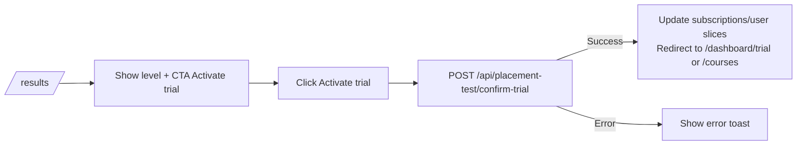

## 02. Placement Test UI

### 1. Призначення feature

Feature **Placement Test UI** реалізує проходження **одного глобального тесту** визначення рівня (A1–B2), збереження відповідей і показ результату, згідно з модулем `docs/modules/02-placement-test.md`.

---

### 2. Сторінки та компоненти

#### 2.1. Сторінки

- `pages/AssessmentPage/AssessmentPage.tsx` — основний інтерфейс тесту.
- `pages/ResultsPage/ResultsPage.tsx` — екран результатів тесту + CTA для trial/курсів.

#### 2.2. Feature-компоненти (`src/features/placement-test/`)

- `PlacementIntro` — вступний блок (пояснення, час проходження, кнопка «Start test»).
- `PlacementQuestionList` або `PlacementQuestionStepper`:
  - відображає питання по одному або блоками.
- `PlacementProgressBar`:
  - кількість пройдених питань / відсоток.
- `PlacementSummary`:
  - узагальнення відповіді, кнопка «Submit test».
- `PlacementResultSummary` (на ResultsPage):
  - показ рівня, коротке пояснення.
- `TrialCTA`:
  - кнопка «Activate free trial» з інтеграцією із Subscriptions.

#### 2.3. UI-компоненти

- `RadioGroup`, `QuestionCard`, `ProgressBar`, `Alert`, `Button`, `Spinner`.

---

### 3. State (Redux, persist)

#### 3.1. Redux slice: `placementTest`

Папка: `src/features/placement-test/redux/placementTestSlice.ts`.

Поля:

- `questions`: масив питань з бекенду (`placement_questions`).
- `answers`: структура `{ [questionId]: selectedOptionId }`.
- `status: 'idle' | 'loading' | 'submitting' | 'completed'`.
- `resultLevel: 'A1' | 'A2' | 'B1' | 'B2' | null`.
- `error: string | null`.

Thunks:

- `fetchPlacementQuestions` → `GET /api/placement-test/questions`.
- `submitPlacementAnswers` → `POST /api/placement-test/submit`.
- `confirmTrial` → `POST /api/placement-test/confirm-trial`.

#### 3.2. Persist

- Можна (опційно) зберігати проміжні `answers` у persist, щоб при випадковому перезавантаженні не втрачати прогрес.
- Результат тесту (`resultLevel`) не обов’язково зберігати — бекенд оновлює `student_profiles.level`, інформація доступна через `user` slice.

---

### 4. Форми та валідація

#### 4.1. Внутрішня модель

- Дані з бекенду:
  - `question_data` (JSON): текст питання, варіанти, правильна відповідь.
- RHF структура:
  - якщо питання по одному:
    - форма з полем `answer` для поточного питання;
  - якщо кілька відразу:
    - форма з полем `answers[questionId]`.

#### 4.2. Валідація

- На боці фронту:
  - вимога: кожне питання має відповідь перед сабмітом.
- На боці бекенду:
  - обчислюється рівень та валідується структура відповідей.

---

### 5. API

- `GET /api/placement-test/questions`:
  - повертає список питань у правильному порядку (`order_index`).
- `POST /api/placement-test/submit`:
  - приймає відповіді;
  - повертає визначений рівень;
  - оновлює `student_profiles.level`.
- `POST /api/placement-test/confirm-trial`:
  - активує trial (або через `subscriptions`, або `trial_ends_at`).

Frontend послідовно:

1. завантажує питання;
2. показує інтерфейс проходження;
3. відправляє відповіді;
4. показує результат;
5. (опційно) дає активувати trial.

---

### 6. Error Handling & Skeletons

- **Skeletons**:
  - при першому `GET /questions`:
    - показ `AssessmentSkeleton` (кілька сірих карток).
- **Errors**:
  - `GET /questions`:
    - на помилку — повідомлення + CTA «Retry».
  - `POST /submit`:
    - показує Alert, але не скидає відповіді; користувач може повторити.
  - `POST /confirm-trial`:
    - у разі помилки — показати toast і запропонувати повтор.

Для `AssessmentPage` можна мати легкий локальний Error Boundary, але достатньо глобального.

---

### 7. Mermaid-flow основних сценаріїв

#### 7.1. Проходження Placement Test

```mermaid
flowchart LR
  A[/assessment/] --> B[dispatch(fetchPlacementQuestions)]
  B --> C[Render questions + progress bar]
  C --> D[User selects answers]
  D --> E[Click Submit test]
  E --> F[POST /api/placement-test/submit]
  F -->|Success| G[Set resultLevel + redirect to /results]
  F -->|Error| H[Show error + keep answers]
```

#### 7.2. Активація trial



