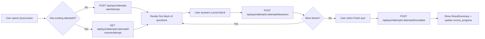

## 05. Progress & Quizzes UI

### 1. Призначення feature

Feature **Progress & Quizzes UI** відповідає за:

- відображення прогресу користувача по курсах/матеріалах;
- покрокове проходження квізів/сценаріїв із можливістю resume;
- показ рекомендованого наступного кроку (course/lesson);
- інтеграцію з модулем `docs/modules/05-progress-quizzes.md`.

---

### 2. Сторінки та компоненти

#### 2.1. Сторінки

- `/profile` (**UserProfilePage**):
  - секція «My progress», «My courses».
- `/dashboard/*`:
  - summary-прогрес (high-level).
- `/courses/:courseId` (**CoursePage**):
  - локальний прогрес курсу (sidebar індикатори).

#### 2.2. Feature-компоненти (`src/features/progress-quizzes/`)

- `ProgressOverview`:
  - використовує `GET /api/progress/me`;
  - показує:
    - завершені курси;
    - відсоток виконання для активних курсів;
    - поточний рівень.
- `CourseProgressSummary`:
  - відображає прогрес для конкретного курсу (`/courses/:courseId`).
- `RecommendedNext`:
  - використовує `GET /api/progress/recommended-next`;
  - показує картку з рекомендованим курсом/модулем.
- `QuizAttemptView`:
  - UI для проходження квізу (type = `quiz` у `course_materials`).
- `ScenarioAttemptView`:
  - UI для сценаріїв (type = `scenario`), використовує дерево `nodes` з JSON (`docs/architecture.md`, п. 3.6).

#### 2.3. UI-компоненти

- `ProgressRing`, `ProgressBar`, `CourseTile`, `QuizQuestionCard`, `ScenarioNodeView`, `ResultSummary`, `SkeletonProgressCards`, `SkeletonQuiz`.

---

### 3. State (Redux, persist)

#### 3.1. Redux slice: `progressQuizzes`

Папка: `src/features/progress-quizzes/redux/progressQuizzesSlice.ts`.

Поля:

- `overallProgress`:
  - дані з `GET /api/progress/me`.
- `courseProgressById`: мапа `{ [courseId]: CourseProgress }`.
- `currentQuizAttempt`:
  - `attemptId`;
  - `courseMaterialId`;
  - `answersSnapshot` (як у БД);
  - `status: 'in_progress' | 'completed' | null`.
- `isLoading`, `error`.

Thunks:

- `fetchOverallProgress` → `GET /api/progress/me`.
- `fetchCourseProgress(courseId)` → `GET /api/courses/:courseId/progress`.
- `fetchRecommendedNext` → `GET /api/progress/recommended-next`.
- `startQuizAttempt(courseMaterialId)` → `POST /api/quiz/attempts`.
- `submitQuizAnswer({ attemptId, payload })` → `POST /api/quiz/attempts/:attemptId/answers`.
- `completeQuizAttempt(attemptId)` → `POST /api/quiz/attempts/:attemptId/complete`.
- `resumeQuizAttempt(attemptId)` → `GET /api/quiz/attempts/:attemptId`.

#### 3.2. Persist

- Можна зберігати:
  - ID останнього `currentQuizAttempt`, щоб після перезавантаження відновити спробу через `resumeQuizAttempt`.
- Основні дані про прогрес приходять із бекенду; фронтенд не є первинним джерелом правди.

---

### 4. Форми та валідація

#### 4.1. Quiz

- RHF-форма:
  - одна або декілька питань одночасно:
    - `answers[questionId] = selectedOptionId`.
- Валідація:
  - обов’язковий вибір відповіді для кожного питання перед переходом до наступного блоку/сабмітом.
- При відповіді:
  - Використання **покрокової відправки**:
    - при натисканні «Next»/«Submit answer» — `submitQuizAnswer`.

#### 4.2. Scenario

- Структура `nodes`:
  - `{ id, type: "situation"|"choice"|"consequence"|"explanation", text, choices?: [{ text, nextNodeId, isCorrect, feedback }] }`.
- UI:
  - послідовна навігація по нодах:
    - ситуація → вибір → наслідок → пояснення.
- Для кожного `choice`:
  - при кліку відправляється `submitQuizAnswer` (як для блоків квізу) або аналогічний endpoint;
  - у `answersSnapshot` зберігається шлях по нодах.

---

### 5. API

Згідно з модулем `Progress & Quizzes`:

- `GET /api/progress/me` — загальний прогрес.
- `GET /api/courses/:courseId/progress` — прогрес по курсу.
- `GET /api/progress/recommended-next` — рекомендований наступний курс/крок.
- `POST /api/quiz/attempts` — почати спробу.
- `POST /api/quiz/attempts/:attemptId/answers` — надіслати відповідь/блок.
- `POST /api/quiz/attempts/:attemptId/complete` — завершити квіз.
- `GET /api/quiz/attempts/:attemptId` — відновити спробу.

---

### 6. Error Handling & Skeletons

- **Skeletons**:
  - `ProgressOverview`:
    - `SkeletonProgressCards` поки чекаємо `GET /api/progress/me`.
  - `QuizAttemptView`:
    - `SkeletonQuiz` поки ініціалізуємо/резюмуємо спробу.
- **Errors**:
  - якщо не вдається завантажити прогрес на `/profile`:
    - показати повідомлення «Unable to load progress» + CTA «Retry»;
    - решта сторінки продовжує працювати.
  - якщо не вдається відновити квіз:
    - показати діалог «We could not restore your quiz attempt» з пропозицією почати заново.

Локальний Error Boundary для секції прогресу не обов’язковий; CoursePage має свій.

---

### 7. Mermaid-flow основних сценаріїв

#### 7.1. Відображення прогресу на профілі

```mermaid
flowchart LR
  A[/profile/] --> B[dispatch(fetchOverallProgress)]
  B --> C[Show SkeletonProgressCards]
  C --> D[Receive data]
  D --> E[Render ProgressOverview + RecommendedNext]
  D -->|Error| F[Show error and Retry button]
```

#### 7.2. Покрокове проходження квізу з resume



