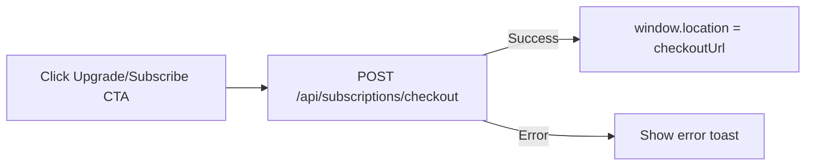

## 06. Subscriptions & Billing UI

### 1. Призначення feature

Feature **Subscriptions & Billing UI** координує:

- показ статусу підписки/triаl користувача;
- запуск Stripe Checkout для оформлення підписки;
- запуск Stripe Customer Portal для керування підпискою;
- відображення історії платежів;
- перевірку доступу до контенту (в тісній інтеграції з `.cursor/rules/stripe-and-access.mdc` та модулем `docs/modules/06-subscriptions-billing.md`).

---

### 2. Сторінки та компоненти

#### 2.1. Сторінки

- `/dashboard/trial` (**TrialDashboardPage**):
  - банер trial, CTA «Upgrade to full access».
- `/dashboard/subscribed` (**SubscribedDashboardPage**):
  - статус підписки, швидкий доступ до курсів.
- `/profile` / `/settings/account`:
  - блок «My subscription».

#### 2.2. Feature-компоненти (`src/features/subscriptions/`)

- `SubscriptionStatusCard`:
  - виводить `status` (`active`, `trialing`, `canceled`, `past_due`, `incomplete`);
  - показує `current_period_end`, `trial_ends_at` (якщо є).
- `SubscriptionBanner`:
  - банер на `/courses`, `/courses/:courseId`, `/dashboard/*`:
    - якщо `trialing` → countdown + CTA «Upgrade»;
    - якщо нема trial/pідписки → CTA «Start assessment» / «Subscribe».
- `CheckoutButton`:
  - натиснення → `POST /api/subscriptions/checkout` → редірект на Stripe Checkout.
- `PortalButton`:
  - натиснення → `POST /api/subscriptions/portal` → редірект на Stripe Customer Portal.
- `PaymentsHistoryTable`:
  - використовує `GET /api/payments/me` для рендеру історії платежів.

#### 2.3. UI-компоненти

- `BadgeStatus`, `Countdown`, `Card`, `Table`, `Button`, `SkeletonSubscriptionCard`, `SkeletonPaymentsTable`.

---

### 3. State (Redux, persist)

#### 3.1. Redux slice: `subscriptions`

Папка: `src/features/subscriptions/redux/subscriptionsSlice.ts`.

Поля:

- `subscription`:
  - `status`, `current_period_end`, `trial_ends_at`, `canceled_at`, інші поля з `subscriptions` таблиці.
- `payments`:
  - масив останніх платежів.
- `isLoadingSubscription`, `isLoadingPayments`.
- `error`.

Thunks:

- `fetchSubscriptionStatus` → `GET /api/subscriptions/me`.
- `fetchPaymentsHistory` → `GET /api/payments/me`.
- `createCheckoutSession` → `POST /api/subscriptions/checkout` (результат — URL для редіректу).
- `createPortalSession` → `POST /api/subscriptions/portal`.

#### 3.2. Persist

- Можна зберігати кеш `subscription`/`payments`, але їх потрібно періодично оновлювати (наприклад, при заході на `/dashboard/*`).

---

### 4. Форми та валідація

Суттєвих форм немає — основна взаємодія:

- кнопки запуску Checkout/Portal;
- фільтри/пагінація в `PaymentsHistoryTable` (простий input/selector).

---

### 5. API

Згідно з модулем `Subscriptions & Billing`:

- `POST /api/subscriptions/checkout`:
  - створює Stripe Checkout Session;
  - повертає URL (redirect).
- `GET /api/subscriptions/me`:
  - поточний статус підписки користувача.
- `POST /api/subscriptions/portal`:
  - повертає URL Customer Portal.
- `GET /api/payments/me`:
  - історія платежів/інвойсів.

Frontend повинен враховувати, що фактичні оновлення статусу відбуваються через webhook `POST /webhooks/stripe`.

---

### 6. Error Handling & Skeletons

- **Skeletons**:
  - `SkeletonSubscriptionCard` — поки чекаємо `GET /api/subscriptions/me`.
  - `SkeletonPaymentsTable` — поки чекаємо `GET /api/payments/me`.
- **Errors**:
  - помилки при завантаженні статусу:
    - показ повідомлення «Unable to load subscription status» + кнопка retry;
  - помилки при запуску Checkout/Portal:
    - toast «We could not connect to Stripe, please try again».

---

### 7. Mermaid-flow основних сценаріїв

#### 7.1. Перевірка статусу та показ банера

```mermaid
flowchart LR
  A[User visits dashboard or courses] --> B[dispatch(fetchSubscriptionStatus)]
  B --> C[Render SkeletonSubscriptionCard/Banner]
  C --> D[Receive subscription]
  D --> E{status}
  E -->|active| F[Hide trial CTA<br/>show Manage billing]
  E -->|trialing| G[Show countdown + Upgrade CTA]
  E -->|none/canceled| H[Show Start assessment / Subscribe CTA]
```

#### 7.2. Запуск Checkout



