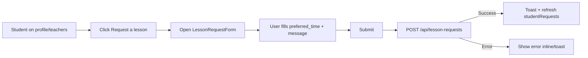
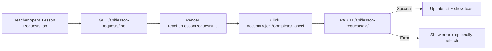

## 07. Lesson Requests UI

### 1. Призначення feature

Feature **Lesson Requests UI** реалізує простий механізм запитів на живі заняття, згідно з модулем `docs/modules/07-lesson-requests.md`:

- студент створює запит (preferred_time, message);
- вчитель переглядає запити, приймає/відхиляє, позначає completed/rejected.

---

### 2. Сторінки та компоненти

#### 2.1. Сторінки / вбудовані секції

- `/profile`:
  - вкладка/секція «Lesson requests» для студента (його запити).
- (Опційно) `/teachers`:
  - сторінка з каталогом вчителів та CTA «Request a lesson» (відкриває форму).
- Teacher view:
  - може бути частиною `/profile` (якщо user.role = `teacher`) — вкладка «Student lesson requests».

#### 2.2. Feature-компоненти (`src/features/lesson-requests/`)

- `LessonRequestForm`:
  - поля: `preferred_time` (text або datetime-local), `message` (textarea).
- `StudentLessonRequestsList`:
  - список запитів поточного студента:
    - статус (pending/accepted/completed/rejected);
    - обраний вчитель (якщо вже accepted).
- `TeacherLessonRequestsList`:
  - список запитів для вчителя:
    - pending + прийняті цим вчителем (accepted).
  - дії:
    - `Accept`, `Reject`, `Complete`, `Cancel`.

#### 2.3. UI-компоненти

- `Card`, `StatusBadge`, `ButtonGroup`, `Modal` (якщо форма показується в модалці), `Table`/`List`.

---

### 3. State (Redux, persist)

#### 3.1. Redux slice: `lessonRequests`

Папка: `src/features/lesson-requests/redux/lessonRequestsSlice.ts`.

Поля:

- `studentRequests`: масив запитів поточного студента.
- `teacherRequests`: масив запитів, що стосуються поточного вчителя (pending + accepted).
- `isLoadingStudent`, `isLoadingTeacher`, `isSubmitting`.
- `error`.

Thunks:

- `createLessonRequest(payload)` → `POST /api/lesson-requests`.
- `fetchStudentLessonRequests` → `GET /api/lesson-requests/me` (для студента).
- `fetchTeacherLessonRequests` → `GET /api/lesson-requests/me` або окремий endpoint для вчителя (за реалізацією бекенду).
- `acceptLessonRequest(id)` → `PATCH /api/lesson-requests/:id/accept`.
- `rejectLessonRequest(id)` → `PATCH /api/lesson-requests/:id/reject`.
- `completeLessonRequest(id)` → `PATCH /api/lesson-requests/:id/complete`.
- `cancelLessonRequest(id)` → `PATCH /api/lesson-requests/:id/cancel`.

#### 3.2. Persist

- Persist не обов’язковий; запити швидко перезавантажуються з бекенду.

---

### 4. Форми та валідація

#### 4.1. LessonRequestForm

- RHF + Zod:
  - `preferred_time`: обов’язкове; схему можна зробити строковою з додатковою перевіркою формату.
  - `message`: опційне або з мінімальною довжиною (наприклад 10 символів).
- UX:
  - при сабміті:
    - кнопка disabled + спіннер;
    - success → очищення форми, toast «Request sent».

---

### 5. API

Згідно з модулем `Lesson Requests`:

- `POST /api/lesson-requests` — створити запит (student).
- `GET /api/lesson-requests/me`:
  - для студента — його запити;
  - для вчителя — запити, доступні йому (pending + accepted).
- `PATCH /api/lesson-requests/:id/accept` — вчитель приймає.
- `PATCH /api/lesson-requests/:id/reject` — вчитель відхиляє.
- `PATCH /api/lesson-requests/:id/complete` — відмітка completed.
- `PATCH /api/lesson-requests/:id/cancel` — відмітка rejected після прийняття.

---

### 6. Error Handling & Skeletons

- **Skeletons**:
  - списки студентських/вчительських запитів:
    - показ кількох `SkeletonRequestCard` до завантаження.
- **Errors**:
  - при створенні запиту:
    - помилки форми (валідація) — inline;
    - помилки сервера — toast «Unable to send request».
  - при діях вчителя:
    - toast при успішній зміні статусу;
    - у разі конфлікту (наприклад, інший вчитель уже прийняв запит) — відмальовка списку за останніми даними.

---

### 7. Mermaid-flow основних сценаріїв

#### 7.1. Студент створює запит

#### 7.2. Вчитель обробляє запит

