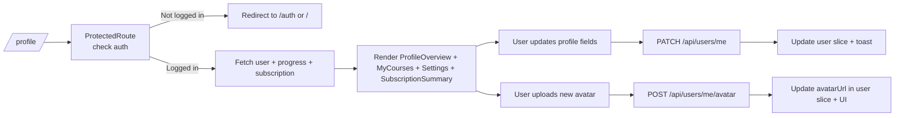

## 09. User Profile UI

### 1. Призначення feature

Feature **User Profile UI** реалізує сторінку `/profile` (або `/me`), що об’єднує:

- огляд прогресу (overview);
- список курсів користувача («My courses»);
- налаштування профілю (displayName, avatar, базові поля);
- інтеграцію з Account Settings, Subscriptions, Progress & Quizzes, Lesson Requests.

---

### 2. Сторінки та компоненти

#### 2.1. Сторінка

- `pages/UserProfilePage/UserProfilePage.tsx`:
  - обгорнута в `ProtectedRoute` та локальний Error Boundary `ProfileErrorBoundary`.

#### 2.2. Feature-компоненти (`src/features/profile/`)

- `ProfileLayout`:
  - основний layout сторінки профілю (наприклад, header + tabs).
- `ProfileOverview`:
  - показує:
    - ім’я/email користувача;
    - роль (student/teacher);
    - поточний рівень (A1–B2);
    - ключові метрики прогресу (з `Progress & Quizzes` feature).
- `MyCoursesSection`:
  - список курсів, де користувач має прогрес:
    - назва, % завершення, CTA «Continue».
- `ProfileSettingsSection`:
  - прості поля (що не перетинаються з AccountSettings) — наприклад displayName/short bio.
- `AvatarUploader`:
  - завантаження/обрізка аватарки, прев’ю, валідація розміру/типу файлу.
- `ProfileSubscriptionSummary`:
  - міні-карта поточного статусу підписки (використовує `subscriptions` slice).
- `ProfileLessonRequestsSnippet`:
  - короткий список останніх lesson requests та CTA перейти до повного списку.

#### 2.3. UI-компоненти

- `Avatar`, `Tabs`, `Card`, `List`, `Button`, `UploadButton`, `SkeletonProfileOverview`, `SkeletonMyCourses`.

---

### 3. State (Redux, persist)

#### 3.1. Redux slices

- `user`:
  - основне джерело правди про користувача.
- `progressQuizzes`:
  - дає дані для прогресу та рекомендованого кроку.
- `subscriptions`:
  - дає статус підписки.
- `lessonRequests`:
  - використовується для секції lesson requests.

Feature `profile` може мати власний slice:

- `profileView`:
  - `activeTab: 'overview' | 'courses' | 'settings' | 'lessonRequests'` (або подібне).
  - `isUploadingAvatar`, `avatarUploadError`.

Persist:

- `activeTab` може зберігатись для зручності, але це не обов’язково.

---

### 4. Форми та валідація

#### 4.1. ProfileSettingsSection

- RHF + Zod:
  - наприклад, `displayName`, `bio` (для вчителя).
- Сабміт:
  - `PATCH /api/users/me` (оновлення дозволених полів, визначених у модулі Users).

#### 4.2. AvatarUploader

- Локальна валідація:
  - тип файлу (`image/jpeg`, `image/png`, `image/webp`).
  - розмір (наприклад, до 5MB).
- Сабміт:
  - `POST /api/users/me/avatar` (endpoint залежить від бекенду);
  - після успіху:
    - оновлюється `user` slice (`avatarUrl`);
    - оновлюється `progress/profileDetails`, якщо використовується.

---

### 5. API

Основні endpoints:

- `GET /api/users/me`:
  - для ініціалізації профілю.
- `PATCH /api/users/me`:
  - оновлення полів профілю (language/timezone — паралельно використовуються AccountSettings).
- `GET /api/progress/me`:
  - загальний прогрес та курси користувача.
- `GET /api/subscriptions/me`:
  - статус підписки.
- `GET /api/lesson-requests/me`:
  - для секції lesson requests.
- `POST /api/users/me/avatar` (якщо реалізовано на бекенді):
  - оновлення аватарки.

---

### 6. Error Handling & Skeletons

- **Skeletons**:
  - `SkeletonProfileOverview`:
    - показується поки `GET /api/users/me` / `GET /api/progress/me` в процесі.
  - `SkeletonMyCourses`:
    - для секції курсів.
- **Errors**:
  - якщо `/me` не завантажується (401):
    - `ProtectedRoute` виконує logout/redirect.
  - інші помилки:
    - `ProfileErrorBoundary` показує fallback з CTA «Back to home» / «Reload».

---

### 7. Mermaid-flow основних сценаріїв

