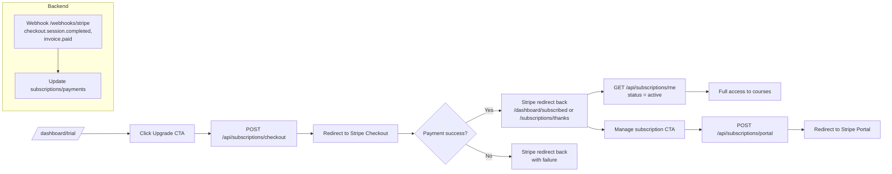
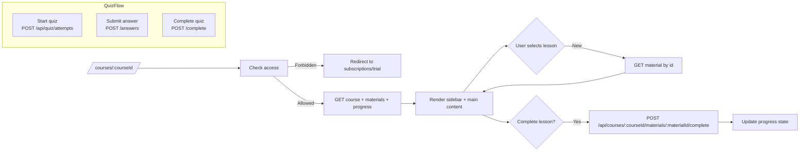
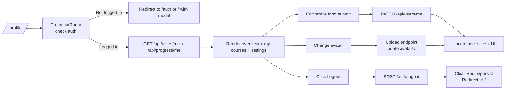
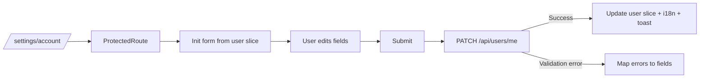

## Overview

Цей документ описує основні **користувацькі флоу** frontend-додатку buero.de, узгоджені з backend-модулями (`docs/modules/*.md`) та frontend-архітектурою (`docs/frontend-architecture.md`). Для кожного флоу наведено текстовий опис та Mermaid-діаграму (`flowchart`).

---

## 1. Onboarding & Placement Test Flow

### 1.1. Опис

Мета: максимально швидко провести нового студента від landing до визначення рівня (A1–B2) та активації trial.

Кроки:

1. Користувач заходить на `/` (**HomePage**).
2. Бачить hero, ключові benefits, секцію «Your progress always visible», testimonials.
3. Натискає **CTA**: «Start assessment» / «Start free trial» (для нових — assessment).
4. Якщо неавторизований:
   - або відкривається модалка login/register;
   - або редірект на `/auth` з поверненням після успіху.
5. Після авторизації користувач потрапляє на `/assessment` (**AssessmentPage**).
6. Frontend завантажує питання через `GET /api/placement-test/questions`.
7. Студент відповідає на всі питання (RHF + Zod).
8. На сабміт:
   - `POST /api/placement-test/submit` → backend обчислює рівень, оновлює `student_profiles.level`.
9. Після отримання результату front відображає `/results` (**ResultsPage**):
   - показує рівень (наприклад, B1);
   - коротке пояснення, рекомендації.
10. Студент натискає CTA «Activate free trial»:
    - `POST /api/placement-test/confirm-trial` → trial у Subscriptions або `student_profiles.trial_ends_at`.
11. Після успішної активації фронт редіректить:
    - на `/dashboard/trial`, якщо немає активної підписки;
    - або одразу на `/courses`, якщо trial/підписка вже дає повний доступ.

### 1.2. Mermaid

```mermaid
flowchart LR
  A[Home /] --> B{Click CTA<br/>Start assessment}
  B -->|Not logged in| C[Auth flow<br/>(/auth or modal)]
  C --> D[Logged in]
  B -->|Already logged in| D

  D --> E[/assessment<br/>load questions]
  E --> F[Student answers<br/>RHF + Zod]
  F --> G[POST /api/placement-test/submit]
  G --> H[/results<br/>show level + CTA]
  H --> I{Activate trial?}
  I -->|Yes| J[POST /api/placement-test/confirm-trial]
  J --> K[/dashboard/trial or /courses]
  I -->|No| L[Stay on /results<br/>or go to /]
```

---

## 2. Trial & Subscription Flow

### 2.1. Опис

Мета: керування trial- та платною підпискою через Stripe Checkout/Portal.

Кроки:

1. На `/dashboard/trial` студент бачить:
   - залишок днів trial;
   - рекомендації щодо курсів;
   - CTA «Upgrade to full access».
2. На натискання CTA:
   - `POST /api/subscriptions/checkout` → backend створює Stripe Checkout Session і повертає URL.
3. Frontend редіректить на Stripe Checkout.
4. Після успішної оплати Stripe редіректить назад (наприклад, на `/dashboard/subscribed` або `/subscriptions/thanks`).
5. Webhook `POST /webhooks/stripe` оновлює `subscriptions`/`payments`.
6. На `/dashboard/subscribed` frontend:
   - запитує `GET /api/subscriptions/me`;
   - показує статус `active`/`past_due`/`canceled`.
7. Користувач може зайти в Customer Portal:
   - кнопка «Manage subscription» → `POST /api/subscriptions/portal` → URL;
   - редірект на Stripe Portal (скасування/оновлення).

### 2.2. Mermaid



---

## 3. Courses Catalog Flow

### 3.1. Опис

Мета: дозволити студенту знайти релевантні курси та перейти до сторінки курсу.

Кроки:

1. Студент потрапляє на `/courses`:
   - з `/dashboard/trial` / `/dashboard/subscribed`;
   - або з `/results` CTA «Browse courses».
2. Frontend перевіряє доступ:
   - через `subscriptions` slice / `GET /api/subscriptions/me`;
   - якщо немає trial/pідписки → редірект на дашборд/CTA до Checkout.
3. Після підтвердження доступу:
   - `GET /api/courses` з query (level, category, search, pagination).
4. Відображається:
   - фільтри (рівень, category `language`/`sociocultural`, тип контенту);
   - список карток курсів (title, category, level badge, short description, free trial badge).
5. Студент змінює фільтри/пошук:
   - debounce → повторний `GET /api/courses`.
6. При кліку на курс:
   - перехід на `/courses/:courseId`.

### 3.2. Mermaid

```mermaid
flowchart LR
  A[/dashboard or /results/] --> B[Go to /courses]
  B --> C[Check content access<br/>trial/subscription]
  C -->|No access| D[Redirect to trial/subscription CTA]
  C -->|Has access| E[GET /api/courses<br/>with filters]
  E --> F[Render filters + course cards]
  F --> G{User updates filters/search?}
  G -->|Yes| E
  F --> H[Click course card]
  H --> I[/courses/:courseId]
```

---

## 4. Course Learning Flow

### 4.1. Опис

Мета: забезпечити повноцінний experience навчання: sidebar уроків, контент уроку (video/quiz/scenario), оновлення прогресу, нотатки.

Кроки:

1. Користувач переходить на `/courses/:courseId`.
2. Frontend перевіряє доступ (`requireContentAccess`).
3. Frontend завантажує:
   - `GET /api/courses/:courseId` — метадані курсу;
   - `GET /api/courses/:courseId/materials` — список матеріалів (modules/lessons);
   - `GET /api/courses/:courseId/progress` — прогрес користувача по курсу.
4. Відображається layout:
   - **Sidebar**: список модулів/уроків (назва, тривалість, статус).
   - **Main area**: поточний матеріал:
     - якщо `type = video` → відеоплеєр (YouTube embed).
     - якщо `quiz`/`scenario` → інтерактивні блоки з RHF/контролями.
5. При зміні вибору уроку в sidebar:
   - Frontend завантажує `GET /api/courses/:courseId/materials/:materialId` (за потреби, або бере з кешу).
6. При завершенні уроку:
   - натискається «Mark as complete» / «Next lesson»:
   - `POST /api/courses/:courseId/materials/:materialId/complete` (Progress & Quizzes).
   - оновлюється прогрес у Redux.
7. Для квізів/сценаріїв:
   - при старті спроби — `POST /api/quiz/attempts`;
   - кожна відповідь — `POST /api/quiz/attempts/:attemptId/answers`;
   - завершення — `POST /api/quiz/attempts/:attemptId/complete`.
8. Нотатки (якщо реалізовані):
   - autosave через debounce: `PATCH /api/notes/:courseMaterialId`.

### 4.2. Mermaid



---

## 5. Profile & My Courses Flow

### 5.1. Опис

Мета: дати студенту централізований огляд свого прогресу, курсів та налаштувань профілю.

Кроки:

1. Користувач заходить на `/profile` (**UserProfilePage**).
2. `ProtectedRoute` перевіряє, що користувач авторизований.
3. Страница завантажує:
   - `GET /api/users/me` — профіль (level, language, timezone, avatar).
   - `GET /api/progress/me` — сумарний прогрес.
   - `GET /api/courses` (за потреби) або окремий список `my courses`.
4. Відображення:
   - **Overview**: поточний рівень, streak, загальний % завершених матеріалів.
   - **My Courses**: список курсів з прогресом і CTA «Continue».
   - **Profile settings**: форма з `language`, `timezone`, ім’ям (якщо є).
5. При редагуванні профілю:
   - RHF-форма → `PATCH /api/users/me` → оновлення `user` slice.
6. При зміні аватарки:
   - upload компонент (drag & drop / file input);
   - `POST /api/users/me/avatar` (або інший endpoint) → оновлення поля `avatarUrl`.
7. Logout:
   - кнопка/посилання → `POST /auth/logout` → front скидає Redux/persist та редіректить на `/`.
8. При невдалому refresh (401 при `GET /api/users/me`):
   - фронт викликає logout flow (автоматично або з повідомленням).

### 5.2. Mermaid



---

## 6. Account & Settings Flow

### 6.1. Опис

Мета: оновлення акаунтних налаштувань (timezone, language, можливо email settings, notification flags).

Кроки:

1. Користувач переходить на `/settings/account` (або вкладку/секцію в `/profile`).
2. `ProtectedRoute` перевіряє auth.
3. Форма ініціалізується даними з `user` slice.
4. При зміні полів:
   - RHF тримає локальний state.
5. На сабміт:
   - `PATCH /api/users/me` з оновленими `language`, `timezone`, іншими дозволеними полями.
   - axios-інтерцептор/обгортка мапить помилки в RHF (`setError`).
6. При успіху:
   - оновлюється `user` slice;
   - i18n оновлює активну мову;
   - показується success-toast.

### 6.2. Mermaid



---

## 7. Lesson Requests / Teacher Flow

### 7.1. Опис (Student)

1. Студент (role = `student`) бачить CTA «Request a lesson»:
   - у `/profile`, `/dashboard/subscribed` або `/teachers`.
2. При натисканні відкривається форма (modal або окрема сторінка):
   - поля `preferred_time` (text/datetime), `message`.
3. На сабміт:
   - `POST /api/lesson-requests` → створення запису.
4. Після успіху:
   - success-toast, оновлення списку запитів через `GET /api/lesson-requests/me`.

### 7.2. Опис (Teacher)

1. Вчитель заходить у відповідну секцію (наприклад, `/profile?tab=lesson-requests` або спеціальну Teacher dashboard-сторінку).
2. Frontend завантажує:
   - `GET /api/lesson-requests/me` або окремий endpoint для вчителя (pending + accepted).
3. Вчитель бачить список запитів з полями:
   - студент, preferred_time, message, поточний статус.
4. Дії:
   - Accept → `PATCH /api/lesson-requests/:id/accept` (status = accepted, teacher_id = current).
   - Reject → `PATCH /api/lesson-requests/:id/reject`.
   - Complete/Cancel → `PATCH /api/lesson-requests/:id/complete` / `:id/cancel`.

### 7.3. Mermaid

```mermaid
flowchart LR
  subgraph StudentFlow
    A[/profile or /teachers/] --> B[Click Request a lesson]
    B --> C[Open form<br/>preferred_time + message]
    C --> D[POST /api/lesson-requests]
    D --> E[Success toast + refresh<br/>GET /api/lesson-requests/me]
  end

  subgraph TeacherFlow
    F[/teacher view/] --> G[GET /api/lesson-requests/me<br/>(pending + accepted)]
    G --> H[Render list of requests]
    H --> I[Accept -> PATCH /accept]
    H --> J[Reject -> PATCH /reject]
    H --> K[Complete/Cancel -> PATCH /complete or /cancel]
  end
```

---

## 8. Subscription & Billing Flow (з перспективи UI)

Цей флоу частково перекриває розділ 2, але фокусується на компонентній взаємодії.

1. **SubscriptionBanner** компонент:
   - відображається на `/dashboard/*`, `/courses`, `/courses/:courseId`, якщо:
     - немає активної підписки, але є trial (показує trial countdown + CTA Checkout);
     - немає ні trial, ні підписки (показує CTA Placement Test / Checkout).
2. **SubscriptionStatusCard**:
   - на `/profile` / `/settings/account` показує статус (`active`, `trialing`, `canceled`), дати, посилання на Customer Portal.
3. Взаємодія:
   - CTA «Upgrade» → Checkout flow.
   - CTA «Manage billing» → Portal flow.

Mermaid-діаграма приведена вище в розділі 2; окремої не дублюємо, щоб уникнути повтору.

---

## 9. Взаємозв’язок флоу та features

- **Onboarding & Placement Test**: використовує `features/placement-test`, `features/auth`, `features/subscriptions`.
- **Trial & Subscription**: `features/subscriptions`, `features/profile`, `features/courses-catalog`.
- **Courses Catalog & Learning**: `features/courses-catalog`, `features/course-learning`, `features/progress-quizzes`.
- **Profile & Settings**: `features/profile`, `features/account-settings` (якщо виділено), `features/subscriptions`.
- **Lesson Requests**: `features/lesson-requests`, використовується і студентом, і вчителем.

Ці флоу є «джерелом правди» для побудови SPA-навігації, стану та інтеграції з backend API.

