# Платформа вивчення німецької мови — Architecture & Database Design (MVP)

**Тема проекту:** Розробка онлайн-платформи для вивчення німецької мови з інтегрованою моделлю соціокультурної адаптації на основі інтерактивних навчальних сценаріїв.

---

## 1. Overview

**MVP платформи:**

- Навчання через **quiz** та **відео-уроки** (відео вбудовані в квізи/модулі).
- **Вчитель** створює курси та контент, але не веде заняття — тільки автор контенту.
- **Курси продаються окремо:** не підписка на весь сервіс, а **купівля/підписка на конкретний курс**. Кожен курс має власну тему навчання та інтеграцію (соціокультурний контекст за темою курсу). Оплата через Stripe (разова купівля курсу або підписка на курс — за політикою продукту).
- **Дві ролі:** Student (той, хто вчиться), Teacher (той, хто створює контент). Адмін-роль не передбачена.
- **Placement Test** → визначення рівня (A1–B2) → Trial: доступ до **одного** курсу на обмежений період (наприклад за рекомендацією за рівнем).
- **Інтерактивні сценарії** з гілками вибору (Scenario Engine), культурний контекст вбудований у курси.
- **Integration & Life in Germany** — не окремий блок, а **категорія курсів** (sociocultural); кожен курс включає інтеграцію за своєю темою.
- Підтримка мов інтерфейсу: **EN / DE**.
- **PostgreSQL** як єдине сховище даних (без Redis для MVP).
- Без форумів/чатів у MVP.

---

## 2. System Architecture

### Компоненти

| Компонент    | Опис |
|-------------|------|
| **Frontend** | Landing, кабінет студента (курси, квізи, прогрес), кабінет вчителя (створення курсів/матеріалів). |
| **Backend API** | Auth (JWT + refresh у Postgres), Users, Courses & Materials, Progress, Quiz/Scenario, Subscriptions, Stripe Webhooks. |
| **Stripe** | Checkout (купівля/підписка на курс), Webhooks, Customer Portal (керування підписками на курси). |

### Authentication

- Реєстрація: email + password (bcrypt).
- **JWT:** access token (короткий TTL), refresh token зберігається в **Postgres** (таблиця `refresh_tokens`).
- Logout / інвалідація: revoke refresh token (blacklist через `revoked_at`).
- Ролі: `student` | `teacher`; доступ до API за роллю.

### Payments (Stripe)

- Картки не зберігаються; Stripe Checkout + Customer Portal.
- **Trial** активується після проходження Placement Test: студент отримує доступ до **одного** курсу на обмежений період (запис у `user_course_access` з типом trial).
- Webhooks: верифікація signature, ідемпотентність через таблицю `stripe_webhook_events`.

---

## 3. Database Schema

### 3.1 users

| Column             | Type      | Notes |
|--------------------|-----------|--------|
| id                 | PK, UUID  | |
| email              | string    | UNIQUE |
| password_hash      | string    | bcrypt |
| role               | enum      | `student` \| `teacher` |
| language           | enum      | `en` \| `de` (мова UI) |
| stripe_customer_id | string    | nullable, один customer на user для Stripe Portal |
| deleted_at         | timestamp | nullable, soft delete (GDPR) |
| created_at         | timestamp | |
| updated_at         | timestamp | |

### 3.2 refresh_tokens

Зберігання refresh-токенів у Postgres (вимога НФ/Ф-001).

| Column     | Type      | Notes |
|------------|-----------|--------|
| id         | PK        | |
| user_id    | FK → users| |
| token_hash | string    | хеш токена |
| expires_at | timestamp | |
| revoked_at | timestamp | nullable |
| created_at | timestamp | |

### 3.3 student_profiles

| Column      | Type      | Notes |
|-------------|-----------|--------|
| id          | PK        | |
| user_id     | FK → users| UNIQUE (1-1) |
| level       | enum      | nullable, `A1` \| `A2` \| `B1` \| `B2` (результат Placement Test) |
| timezone    | string    | IANA, напр. Europe/Kyiv |
| trial_ends_at | timestamp | nullable, кінець trial після Placement Test |
| created_at  | timestamp | |
| updated_at  | timestamp | |

### 3.4 teacher_profiles

Вчитель лише створює контент; оплати по годинах немає.

| Column     | Type      | Notes |
|------------|-----------|--------|
| id         | PK        | |
| user_id    | FK → users| UNIQUE (1-1) |
| bio        | text      | nullable |
| is_active  | boolean   | |
| created_at | timestamp | |
| updated_at | timestamp | |

### 3.5 courses

Контент: мовні модулі та соціокультурні (Integration & Life in Germany) — одна модель, різниця за `category`.

| Column       | Type      | Notes |
|--------------|-----------|--------|
| id           | PK        | |
| teacher_id   | FK → users| nullable, хто створив (для історії); не використовується для обмеження доступу — будь-який вчитель може редагувати будь-який курс |
| title        | string    | |
| description  | text      | nullable |
| language     | enum      | `en` \| `de` (мова контенту) |
| category     | enum      | `language` \| `sociocultural` (Integration/Life in Germany) |
| is_published | boolean   | |
| created_at   | timestamp | |
| updated_at   | timestamp | |

### 3.6 course_materials

Один тип контенту для всього: відео, лексика, граматика, квіз, сценарій, культурна вставка, домашнє завдання. **Відео:** хостинг — YouTube (MVP); у `content` для type = video зберігаємо `youtube_video_id` для embed. Деталі та альтернатива (S3 для контролю та відсутності реклами) — у модулі Course Materials (04-course-materials.md).

| Column      | Type       | Notes |
|-------------|------------|--------|
| id          | PK         | |
| course_id   | FK → courses | |
| type        | enum       | `video` \| `vocabulary` \| `grammar` \| `quiz` \| `scenario` \| `cultural_insight` \| `homework` \| `text` |
| title       | string     | |
| content     | text/json  | для scenario — JSON з нодами та гілками; для video — мінімум `youtube_video_id` (див. 04-course-materials) |
| order_index | int        | порядок у модулі/курсі |
| created_at  | timestamp  | |
| updated_at  | timestamp  | |

**Сценарій (type = scenario):** `content` — JSON, наприклад:

- `nodes`: масив `{ id, type: "situation"|"choice"|"consequence"|"explanation", text, choices?: [{ text, nextNodeId, isCorrect, feedback }] }`.
- Мінімум 3 гілки на сценарій (Ф-004); збереження результату проходження — у `quiz_attempts` або окремому полі в `course_progress`.

### 3.7 user_course_access

Доступ студента до курсу: купівля, trial або підписка на цей курс. Один запис на пару (user_id, course_id). Перевірка доступу до контенту курсу — наявність активного запису (trial_ends_at > now() для trial, або активна підписка, або access_type = purchase).

| Column           | Type      | Notes |
|------------------|-----------|--------|
| id               | PK        | |
| user_id          | FK → users| |
| course_id        | FK → courses | |
| access_type      | enum      | `trial` \| `purchase` \| `subscription` |
| trial_ends_at    | timestamp | nullable; для trial — до якої дати доступ |
| subscription_id  | FK → subscriptions | nullable; для access_type = subscription |
| payment_id       | FK → payments | nullable; для разової купівлі (access_type = purchase) |
| created_at       | timestamp | |

**Унікальність:** UNIQUE(user_id, course_id). Один тип доступу на курс на користувача (при купівлі після trial оновлюємо запис на purchase і заповнюємо payment_id).

### 3.8 subscriptions

Підписка на **конкретний курс** (або помісячна підписка на курс). Користувач може мати кілька підписок — по одній на кожен курс.

| Column                 | Type      | Notes |
|------------------------|-----------|--------|
| id                     | PK        | |
| user_id                | FK → users| |
| course_id              | FK → courses | **підписка на цей курс** |
| stripe_customer_id     | string    | копія для зручності (канонічне в users) |
| stripe_subscription_id | string    | UNIQUE (ідемпотентність webhook) |
| status                 | enum      | `active` \| `past_due` \| `canceled` \| `incomplete` \| `trialing` |
| current_period_start   | timestamp | nullable |
| current_period_end     | timestamp | nullable |
| canceled_at            | timestamp | nullable |
| cancellation_reason    | text      | nullable |
| created_at             | timestamp | |
| updated_at             | timestamp | |

**Обмеження:** один активний subscription на пару (user_id, course_id): partial unique `(user_id, course_id) WHERE status IN ('active', 'trialing')`.

### 3.9 payments

| Column            | Type      | Notes |
|-------------------|-----------|--------|
| id                | PK        | |
| user_id           | FK → users| |
| course_id         | FK → courses | nullable; для разової купівлі курсу |
| subscription_id   | FK → subscriptions | nullable; для платежів по підписці |
| stripe_invoice_id | string    | UNIQUE (ідемпотентність) |
| amount            | decimal   | |
| currency          | string    | |
| status            | string    | |
| created_at        | timestamp | |

### 3.10 stripe_webhook_events

Ідемпотентність обробки Stripe webhook.

| Column          | Type      | Notes |
|-----------------|-----------|--------|
| id              | PK        | |
| stripe_event_id | string    | UNIQUE (Stripe event id) |
| processed_at    | timestamp | |

### 3.11 course_progress

Прогрес по курсах/матеріалах (завершені модулі, відсоток, рекомендований крок).

| Column           | Type       | Notes |
|------------------|------------|--------|
| id               | PK         | |
| user_id          | FK → users | |
| course_id        | FK → courses | |
| course_material_id| FK → course_materials | nullable (можна агрегувати тільки по course) |
| completed_at     | timestamp  | |
| score            | decimal    | nullable, % або бали |
| created_at       | timestamp  | |

Унікальність: один запис на (user_id, course_id, course_material_id) для "пройдено матеріал", або один запис на (user_id, course_id) з оновленням прогресу — залежить від логіки (наприклад UNIQUE(user_id, course_id, course_material_id)).

### 3.12 quiz_attempts

Результати проходження квізів та сценаріїв. **Кожна відповідь зберігається окремо** (покроково), щоб користувач міг продовжити квіз після переривання без повторного проходження.

| Column           | Type       | Notes |
|------------------|------------|--------|
| id               | PK         | |
| user_id          | FK → users | |
| course_material_id | FK → course_materials | |
| score            | decimal    | nullable до завершення |
| answers_snapshot | jsonb      | проміжні відповіді по блоках (для resume) |
| completed_at     | timestamp  | nullable поки не завершено |
| created_at       | timestamp  | |

Окрема таблиця **quiz_attempt_answers** (опціонально): attempt_id, block_index або question_id, answer, created_at — для збереження кожної відповіді окремо; альтернатива — накопичувати в answers_snapshot.

### 3.13 lesson_requests

Запит на заняття: студент створює запит; **вчитель** приймає або відхиляє, далі виставляє статус «пройшло» або «відхилено». Вчитель після прийняття зв’язується з користувачем поза платформою.

| Column        | Type      | Notes |
|---------------|-----------|--------|
| id            | PK        | |
| student_id    | FK → users| |
| teacher_id    | FK → users| nullable, вчитель, який прийняв запит |
| preferred_time| text/timestamp | бажаний час (можна text для MVP) |
| message       | text      | nullable |
| status        | enum      | `pending` \| `accepted` \| `completed` \| `rejected` |
| created_at    | timestamp | |
| updated_at    | timestamp | |

**Логіка:** pending → вчитель приймає (accepted, teacher_id заповнюється) → вчитель виставляє completed або rejected.

### 3.14 placement_questions (один тест визначення рівня)

Питання **одного** тесту визначення рівня (Placement Test). **Не прив'язані до курсу** — це єдиний глобальний тест для визначення A1–B2 при старті.

| Column       | Type       | Notes |
|--------------|------------|--------|
| id           | PK         | |
| level        | enum       | nullable, `A1` \| `A2` \| `B1` \| `B2` — складність/діапазон питання в межах одного placement-тесту |
| question_data| jsonb      | текст питання, варіанти відповідей, правильна відповідь тощо |
| order_index  | int        | порядок у тесті |
| created_at   | timestamp  | |
| updated_at   | timestamp  | |

Рівень студента визначається за кількістю правильних відповідей (MVP).

### 3.15 Тести в кінці курсів

**Усі інші тести** (у кінці кожного курсу, на підвищення рівня) **прив'язані до курсу**. Вони реалізуються як **course_materials** з **type = quiz** — тобто це матеріал курсу (course_id), а не окрема таблиця тестів.

- Питання такого тесту: або в полі **content** (JSON) цього матеріалу, або в окремій таблиці **quiz_questions** з **course_material_id** (FK → course_materials).
- Проходження зберігається в **quiz_attempts** (course_material_id). Після успішного проходження тесту в кінці курсу можна оновлювати **student_profiles.level** (модуль Progress & Quizzes).

### 3.16 placement_results (опціонально)

Історія проходжень Placement Test. Для MVP достатньо оновлення `student_profiles.level`.

| Column      | Type      | Notes |
|-------------|-----------|--------|
| id          | PK        | |
| user_id     | FK → users| |
| level       | enum      | A1 \| A2 \| B1 \| B2 |
| raw_score   | int       | nullable |
| completed_at| timestamp | |

---

## 4. Діаграма архітектури бази даних (ER)

Нижче — ER-діаграма основних сутностей та зв’язків. Службова таблиця `stripe_webhook_events` не показана для стислості.

```mermaid
erDiagram
    users ||--o| student_profiles : "1-1"
    users ||--o| teacher_profiles : "1-1"
    users ||--o{ refresh_tokens : has
    users ||--o{ user_course_access : has
    users ||--o{ subscriptions : has
    users ||--o{ payments : has
    courses ||--o{ user_course_access : "access to"
    users ||--o{ course_progress : has
    users ||--o{ quiz_attempts : has
    users ||--o{ lesson_requests : "student requests"

    users {
        uuid id PK
        string email
        string password_hash
        enum role "student|teacher"
        enum language "en|de"
        string stripe_customer_id
        timestamp deleted_at
        timestamp created_at
        timestamp updated_at
    }

    student_profiles {
        uuid id PK
        uuid user_id FK
        enum level "A1|A2|B1|B2"
        string timezone
        timestamp trial_ends_at
        timestamp created_at
        timestamp updated_at
    }

    teacher_profiles {
        uuid id PK
        uuid user_id FK
        text bio
        boolean is_active
        timestamp created_at
        timestamp updated_at
    }

    refresh_tokens {
        uuid id PK
        uuid user_id FK
        string token_hash
        timestamp expires_at
        timestamp revoked_at
        timestamp created_at
    }

    courses {
        uuid id PK
        uuid teacher_id FK
        string title
        text description
        enum language "en|de"
        enum category "language|sociocultural"
        boolean is_published
        timestamp created_at
        timestamp updated_at
    }

    course_materials {
        uuid id PK
        uuid course_id FK
        enum type "video|vocabulary|grammar|quiz|scenario|cultural_insight|homework|text"
        string title
        text content
        int order_index
        timestamp created_at
        timestamp updated_at
    }

    user_course_access {
        uuid id PK
        uuid user_id FK
        uuid course_id FK
        enum access_type "trial|purchase|subscription"
        timestamp trial_ends_at
        uuid subscription_id FK
        uuid payment_id FK
        timestamp created_at
    }

    subscriptions {
        uuid id PK
        uuid user_id FK
        uuid course_id FK
        string stripe_subscription_id
        enum status "active|trialing|past_due|canceled|incomplete"
        timestamp current_period_start
        timestamp current_period_end
        timestamp canceled_at
        text cancellation_reason
        timestamp created_at
        timestamp updated_at
    }

    payments {
        uuid id PK
        uuid user_id FK
        uuid course_id FK
        uuid subscription_id FK
        string stripe_invoice_id
        decimal amount
        string currency
        string status
        timestamp created_at
    }

    course_progress {
        uuid id PK
        uuid user_id FK
        uuid course_id FK
        uuid course_material_id FK
        timestamp completed_at
        decimal score
        timestamp created_at
    }

    quiz_attempts {
        uuid id PK
        uuid user_id FK
        uuid course_material_id FK
        decimal score
        jsonb answers_snapshot
        timestamp completed_at
    }

    lesson_requests {
        uuid id PK
        uuid student_id FK
        uuid teacher_id FK
        string preferred_time
        text message
        enum status "pending|accepted|completed|rejected"
        timestamp created_at
        timestamp updated_at
    }

    users ||--o{ courses : "teacher creates"
    courses ||--o{ course_materials : contains
```



**Схема зв’язків (текстом):**

- **users** — ядро: студенти мають student_profiles, вчителі — teacher_profiles; один user — один профіль за роллю.
- **courses** — належать teacher; мають **category** (`language` | `sociocultural`); кожен курс — окремий продукт (своя тема, інтеграція).
- **course_materials** — елементи курсу (відео, квіз, сценарій тощо); сценарії з гілками в `content` (JSON). Матеріали типу **quiz** — тести в кінці курсу.
- **user_course_access** — доступ студента до курсу: trial, purchase або subscription на цей курс; UNIQUE(user_id, course_id).
- **subscriptions** / **payments** — підписка та платежі **прив’язані до курсу** (subscriptions.course_id, payments.course_id); один активний subscription на (user_id, course_id).
- **course_progress** + **quiz_attempts** — прогрес і результати квізів/сценаріїв.
- **lesson_requests** — студент створює запит; вчитель приймає/відхиляє, виставляє completed/rejected.
- **refresh_tokens** — зберігання refresh-токенів у Postgres для JWT (logout / ротація).

---

## 5. Webhook Processing (Stripe)

**Endpoint:** `POST /webhooks/stripe`

- Перевірка signature.
- Ідемпотентність: перед обробкою `INSERT INTO stripe_webhook_events (stripe_event_id)`; при UNIQUE conflict — пропустити.

| Event                          | Дія в БД |
|--------------------------------|----------|
| `checkout.session.completed`   | Створити/оновити subscription (з course_id з метаданих сесії), створити/оновити запис user_course_access для цього курсу. |
| `invoice.paid`                 | Записати payment (course_id з subscription або з метаданих), оновити subscription.status = active. |
| `customer.subscription.updated`| Синхронізувати period_start/end, status. |
| `customer.subscription.deleted`| subscription.status = canceled, canceled_at = now(); оновити user_course_access (прибрати посилання на subscription або позначити недоступ). |

---

## 6. Business Rules (коротко)

- **Доступ до контенту курсу:** студент має доступ до курсу тільки якщо є активний запис у **user_course_access** для (user_id, course_id): trial (trial_ends_at > now()), або purchase, або активна підписка (subscription_id → subscriptions.status = active/trialing). Список курсів (каталог) — показуємо всі опубліковані; перегляд матеріалів і прогрес — лише по курсах, до яких є доступ.
- **Placement Test** обов’язковий для визначення рівня; один глобальний тест (placement_questions); результат у `student_profiles.level`. Після підтвердження trial — створити запис **user_course_access** для **одного** курсу (наприклад рекомендованого за рівнем) з access_type = trial та trial_ends_at = now() + N днів.
- **Рівень:** оновлюється автоматично в навчанні. Вчитель — адмін контенту: курси/матеріали; приймає запити на заняття. Будь-який вчитель може створювати/редагувати/видаляти будь-який курс. Поле `courses.teacher_id` — «хто створив», не для обмеження доступу.
- Один активний subscription на пару (user_id, course_id). Купівля курсу (разова) створює user_course_access з access_type = purchase та payment_id.
- Integration & Life in Germany — курси з `courses.category = 'sociocultural'`. Рекомендований наступний крок — наступний курс за рівнем (модуль Progress).

---

## 7. Security & NFR (з requirements)

- HTTPS, bcrypt для паролів, JWT (access + refresh у Postgres), rate limiting, CORS.
- Картки не зберігаються; Stripe Checkout + верифікація webhook.
- Перевірка прав доступу до модуля; за потреби — заборона "перескочити" рівень без проходження попереднього (логіка в бекенді на основі `course_progress` та `level`).

Session management: у MVP без Redis — сесії через JWT; refresh токени в Postgres. НФ-002 (Redis для session) для MVP не застосовуємо.

---

## 8. Індекси (рекомендовані)

```sql
CREATE INDEX idx_users_email ON users(email);
CREATE INDEX idx_users_stripe_customer_id ON users(stripe_customer_id) WHERE stripe_customer_id IS NOT NULL;
CREATE UNIQUE INDEX idx_user_course_access_user_course ON user_course_access(user_id, course_id);
CREATE INDEX idx_user_course_access_user_id ON user_course_access(user_id);
CREATE INDEX idx_user_course_access_course_id ON user_course_access(course_id);
CREATE UNIQUE INDEX idx_subscriptions_user_course_active ON subscriptions(user_id, course_id) WHERE status IN ('active', 'trialing');
CREATE INDEX idx_subscriptions_user_id ON subscriptions(user_id);
CREATE INDEX idx_subscriptions_course_id ON subscriptions(course_id);
CREATE UNIQUE INDEX idx_subscriptions_stripe_subscription_id ON subscriptions(stripe_subscription_id);
CREATE INDEX idx_courses_teacher_id ON courses(teacher_id);
CREATE INDEX idx_courses_category ON courses(category);
CREATE INDEX idx_course_materials_course_id ON course_materials(course_id);
CREATE INDEX idx_course_progress_user_course ON course_progress(user_id, course_id);
CREATE INDEX idx_quiz_attempts_user ON quiz_attempts(user_id);
CREATE INDEX idx_lesson_requests_student ON lesson_requests(student_id);
CREATE INDEX idx_lesson_requests_teacher ON lesson_requests(teacher_id);
CREATE UNIQUE INDEX idx_stripe_webhook_events_event_id ON stripe_webhook_events(stripe_event_id);
```

---

## 9. Minimal MVP Flow

1. Реєстрація (Student/Teacher).
2. **Student:** проходження Placement Test → збереження рівня; підтвердження trial → доступ до **одного** курсу на обмежений період (user_course_access).
3. Каталог курсів (всі опубліковані); перегляд матеріалів і проходження — лише по курсах, до яких є доступ (user_course_access).
4. Збереження прогресу (course_progress, quiz_attempts).
5. Купівля/підписка на курс (Stripe Checkout з course_id) → створення user_course_access та subscription/payment; продовження доступу після trial або новий курс.
6. Опційно: "Request a lesson" (lesson_requests → обробка вручну).
7. Скасування підписки на курс (Stripe Portal або наш UI) → webhook → оновлення статусу subscription та доступу.

---

## 10. Tech Stack (MVP)

| Шар        | Технологія |
|------------|------------|
| Backend API| Node.js    |
| DB         | PostgreSQL |
| ORM        | Prisma     |
| Payments   | Stripe (Checkout, Subscriptions, Webhooks) |
| Auth       | JWT (access + refresh у Postgres) |
| Кеш/сесії  | Не використовуємо Redis у MVP |

---

## 11. Підсумок

- **Ядро:** users (student/teacher), student_profiles (level), teacher_profiles, courses (category = language | sociocultural), course_materials (типи: video, quiz, scenario, …).
- **Доступ до курсу:** user_course_access (trial / purchase / subscription на кожен курс); перевірка доступу до матеріалів — по цій таблиці.
- **Навчання:** прогрес у course_progress та quiz_attempts; сценарії з гілками — JSON у content.
- **Білінг:** курси продаються окремо; subscriptions (з course_id) + payments (з course_id) + stripe_webhook_events; Stripe Customer Portal для керування підписками на курси.
- **Спрощене "урок":** lesson_requests без календаря.
- **Integration & Life in Germany** — курси з `category = 'sociocultural'`; кожен курс включає тему та інтеграцію за нею.

Далі можна додати: деталізацію JSON-схеми для сценаріїв, приклади API endpoints, або окремий файл `billing.md` для Stripe та політики скасування.
