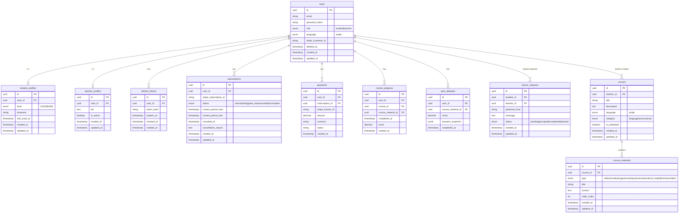

# Платформа вивчення німецької мови — Architecture & Database Design (MVP)

**Тема проекту:** Розробка онлайн-платформи для вивчення німецької мови з інтегрованою моделлю соціокультурної адаптації на основі інтерактивних навчальних сценаріїв.

---

## 1. Overview

**MVP платформи:**

- Навчання через **quiz** та **відео-уроки** (відео вбудовані в квізи/модулі).
- **Вчитель** створює курси та контент, але не веде заняття — тільки автор контенту.
- **Помісячна підписка** (Stripe), без оплати по годинах.
- **Дві ролі:** Student (той, хто вчиться), Teacher (той, хто створює контент). Адмін-роль не передбачена.
- **Placement Test** → визначення рівня (A1–B2) → Trial і доступ до відповідного модуля.
- **Інтерактивні сценарії** з гілками вибору (Scenario Engine), культурний контекст вбудований у курси.
- **Integration & Life in Germany** — не окремий блок, а **категорія курсів** (sociocultural).
- Підтримка мов інтерфейсу: **EN / DE**.
- **PostgreSQL** як єдине сховище даних (без Redis для MVP).
- Без форумів/чатів у MVP.

---

## 2. System Architecture

### Компоненти

| Компонент    | Опис |
|-------------|------|
| **Frontend** | Landing, кабінет студента (курси, квізи, прогрес), кабінет вчителя (створення курсів/матеріалів). |
| **Backend API** | Auth (JWT + refresh у Postgres), Users, Courses & Materials, Progress, Quiz/Scenario, Subscriptions, Stripe Webhooks. |
| **Stripe** | Checkout, помісячні підписки, Webhooks, Customer Portal (керування підпискою). |

### Authentication

- Реєстрація: email + password (bcrypt).
- **JWT:** access token (короткий TTL), refresh token зберігається в **Postgres** (таблиця `refresh_tokens`).
- Logout / інвалідація: revoke refresh token (blacklist через `revoked_at`).
- Ролі: `student` | `teacher`; доступ до API за роллю.

### Payments (Stripe)

- Картки не зберігаються; Stripe Checkout + Customer Portal.
- **Trial** активується після проходження Placement Test (зберігаємо `trial_ends_at` у профілі студента або статус підписки `trialing`).
- Webhooks: верифікація signature, ідемпотентність через таблицю `stripe_webhook_events`.

---

## 3. Database Schema

### 3.1 users

| Column             | Type      | Notes |
|--------------------|-----------|--------|
| id                 | PK, UUID  | |
| email              | string    | UNIQUE |
| password_hash      | string    | bcrypt |
| role               | enum      | `student` \| `teacher` |
| language           | enum      | `en` \| `de` (мова UI) |
| stripe_customer_id | string    | nullable, один customer на user для Stripe Portal |
| deleted_at         | timestamp | nullable, soft delete (GDPR) |
| created_at         | timestamp | |
| updated_at         | timestamp | |

### 3.2 refresh_tokens

Зберігання refresh-токенів у Postgres (вимога НФ/Ф-001).

| Column     | Type      | Notes |
|------------|-----------|--------|
| id         | PK        | |
| user_id    | FK → users| |
| token_hash | string    | хеш токена |
| expires_at | timestamp | |
| revoked_at | timestamp | nullable |
| created_at | timestamp | |

### 3.3 student_profiles

| Column      | Type      | Notes |
|-------------|-----------|--------|
| id          | PK        | |
| user_id     | FK → users| UNIQUE (1-1) |
| level       | enum      | nullable, `A1` \| `A2` \| `B1` \| `B2` (результат Placement Test) |
| timezone    | string    | IANA, напр. Europe/Kyiv |
| trial_ends_at | timestamp | nullable, кінець trial після Placement Test |
| created_at  | timestamp | |
| updated_at  | timestamp | |

### 3.4 teacher_profiles

Вчитель лише створює контент; оплати по годинах немає.

| Column     | Type      | Notes |
|------------|-----------|--------|
| id         | PK        | |
| user_id    | FK → users| UNIQUE (1-1) |
| bio        | text      | nullable |
| is_active  | boolean   | |
| created_at | timestamp | |
| updated_at | timestamp | |

### 3.5 courses

Контент: мовні модулі та соціокультурні (Integration & Life in Germany) — одна модель, різниця за `category`.

| Column       | Type      | Notes |
|--------------|-----------|--------|
| id           | PK        | |
| teacher_id   | FK → users| nullable, хто створив (для історії); не використовується для обмеження доступу — будь-який вчитель може редагувати будь-який курс |
| title        | string    | |
| description  | text      | nullable |
| language     | enum      | `en` \| `de` (мова контенту) |
| category     | enum      | `language` \| `sociocultural` (Integration/Life in Germany) |
| is_published | boolean   | |
| created_at   | timestamp | |
| updated_at   | timestamp | |

### 3.6 course_materials

Один тип контенту для всього: відео, лексика, граматика, квіз, сценарій, культурна вставка, домашнє завдання. **Відео:** хостинг — YouTube (MVP); у `content` для type = video зберігаємо `youtube_video_id` для embed. Деталі та альтернатива (S3 для контролю та відсутності реклами) — у модулі Course Materials (04-course-materials.md).

| Column      | Type       | Notes |
|-------------|------------|--------|
| id          | PK         | |
| course_id   | FK → courses | |
| type        | enum       | `video` \| `vocabulary` \| `grammar` \| `quiz` \| `scenario` \| `cultural_insight` \| `homework` \| `text` |
| title       | string     | |
| content     | text/json  | для scenario — JSON з нодами та гілками; для video — мінімум `youtube_video_id` (див. 04-course-materials) |
| order_index | int        | порядок у модулі/курсі |
| created_at  | timestamp  | |
| updated_at  | timestamp  | |

**Сценарій (type = scenario):** `content` — JSON, наприклад:

- `nodes`: масив `{ id, type: "situation"|"choice"|"consequence"|"explanation", text, choices?: [{ text, nextNodeId, isCorrect, feedback }] }`.
- Мінімум 3 гілки на сценарій (Ф-004); збереження результату проходження — у `quiz_attempts` або окремому полі в `course_progress`.

### 3.7 subscriptions

Помісячна підписка; один активний subscription на користувача.

| Column                 | Type      | Notes |
|------------------------|-----------|--------|
| id                     | PK        | |
| user_id                | FK → users| |
| stripe_customer_id     | string    | копія для зручності (канонічне значення в users) |
| stripe_subscription_id | string    | UNIQUE (ідемпотентність webhook) |
| status                 | enum      | `active` \| `past_due` \| `canceled` \| `incomplete` \| `trialing` |
| current_period_start   | timestamp | nullable |
| current_period_end     | timestamp | nullable |
| canceled_at            | timestamp | nullable |
| cancellation_reason    | text      | nullable (опитування "Чому пішли?") |
| created_at             | timestamp | |
| updated_at             | timestamp | |

**Обмеження:** partial unique index `(user_id) WHERE status = 'active'` або еквівалент для одного активного subscription на user.

### 3.8 payments

| Column            | Type      | Notes |
|-------------------|-----------|--------|
| id                | PK        | |
| user_id           | FK → users| |
| subscription_id    | FK → subscriptions | nullable |
| stripe_invoice_id | string    | UNIQUE (ідемпотентність) |
| amount            | decimal   | |
| currency          | string    | |
| status            | string    | |
| created_at        | timestamp | |

### 3.9 stripe_webhook_events

Ідемпотентність обробки Stripe webhook.

| Column          | Type      | Notes |
|-----------------|-----------|--------|
| id              | PK        | |
| stripe_event_id | string    | UNIQUE (Stripe event id) |
| processed_at    | timestamp | |

### 3.10 course_progress

Прогрес по курсах/матеріалах (завершені модулі, відсоток, рекомендований крок).

| Column           | Type       | Notes |
|------------------|------------|--------|
| id               | PK         | |
| user_id          | FK → users | |
| course_id        | FK → courses | |
| course_material_id| FK → course_materials | nullable (можна агрегувати тільки по course) |
| completed_at     | timestamp  | |
| score            | decimal    | nullable, % або бали |
| created_at       | timestamp  | |

Унікальність: один запис на (user_id, course_id, course_material_id) для "пройдено матеріал", або один запис на (user_id, course_id) з оновленням прогресу — залежить від логіки (наприклад UNIQUE(user_id, course_id, course_material_id)).

### 3.11 quiz_attempts

Результати проходження квізів та сценаріїв. **Кожна відповідь зберігається окремо** (покроково), щоб користувач міг продовжити квіз після переривання без повторного проходження.

| Column           | Type       | Notes |
|------------------|------------|--------|
| id               | PK         | |
| user_id          | FK → users | |
| course_material_id | FK → course_materials | |
| score            | decimal    | nullable до завершення |
| answers_snapshot | jsonb      | проміжні відповіді по блоках (для resume) |
| completed_at     | timestamp  | nullable поки не завершено |
| created_at       | timestamp  | |

Окрема таблиця **quiz_attempt_answers** (опціонально): attempt_id, block_index або question_id, answer, created_at — для збереження кожної відповіді окремо; альтернатива — накопичувати в answers_snapshot.

### 3.12 lesson_requests

Запит на заняття: студент створює запит; **вчитель** приймає або відхиляє, далі виставляє статус «пройшло» або «відхилено». Вчитель після прийняття зв’язується з користувачем поза платформою.

| Column        | Type      | Notes |
|---------------|-----------|--------|
| id            | PK        | |
| student_id    | FK → users| |
| teacher_id    | FK → users| nullable, вчитель, який прийняв запит |
| preferred_time| text/timestamp | бажаний час (можна text для MVP) |
| message       | text      | nullable |
| status        | enum      | `pending` \| `accepted` \| `completed` \| `rejected` |
| created_at    | timestamp | |
| updated_at    | timestamp | |

**Логіка:** pending → вчитель приймає (accepted, teacher_id заповнюється) → вчитель виставляє completed або rejected.

### 3.13 placement_questions (один тест визначення рівня)

Питання **одного** тесту визначення рівня (Placement Test). **Не прив'язані до курсу** — це єдиний глобальний тест для визначення A1–B2 при старті.

| Column       | Type       | Notes |
|--------------|------------|--------|
| id           | PK         | |
| level        | enum       | nullable, `A1` \| `A2` \| `B1` \| `B2` — складність/діапазон питання в межах одного placement-тесту |
| question_data| jsonb      | текст питання, варіанти відповідей, правильна відповідь тощо |
| order_index  | int        | порядок у тесті |
| created_at   | timestamp  | |
| updated_at   | timestamp  | |

Рівень студента визначається за кількістю правильних відповідей (MVP).

### 3.14 Тести в кінці курсів

**Усі інші тести** (у кінці кожного курсу, на підвищення рівня) **прив'язані до курсу**. Вони реалізуються як **course_materials** з **type = quiz** — тобто це матеріал курсу (course_id), а не окрема таблиця тестів.

- Питання такого тесту: або в полі **content** (JSON) цього матеріалу, або в окремій таблиці **quiz_questions** з **course_material_id** (FK → course_materials).
- Проходження зберігається в **quiz_attempts** (course_material_id). Після успішного проходження тесту в кінці курсу можна оновлювати **student_profiles.level** (модуль Progress & Quizzes).

### 3.15 placement_results (опціонально)

Історія проходжень Placement Test. Для MVP достатньо оновлення `student_profiles.level`.

| Column      | Type      | Notes |
|-------------|-----------|--------|
| id          | PK        | |
| user_id     | FK → users| |
| level       | enum      | A1 \| A2 \| B1 \| B2 |
| raw_score   | int       | nullable |
| completed_at| timestamp | |

---

## 4. Діаграма архітектури бази даних (ER)

Нижче — ER-діаграма основних сутностей та зв’язків. Службова таблиця `stripe_webhook_events` не показана для стислості.



**Схема зв’язків (текстом):**

- **users** — ядро: студенти мають student_profiles, вчителі — teacher_profiles; один user — один профіль за роллю.
- **courses** — належать teacher; мають **category** (`language` | `sociocultural`) для розділу "Integration & Life in Germany".
- **course_materials** — елементи курсу (відео, квіз, сценарій тощо); сценарії з гілками в `content` (JSON). Матеріали типу **quiz** використовуються як тести в кінці курсу (прив'язані до курсу).
- **subscriptions** / **payments** — прив’язані до user; subscription один активний на user (partial unique).
- **course_progress** + **quiz_attempts** — прогрес і результати квізів/сценаріїв для відображення "завершені модулі", "відсоток правильних", "рекомендований крок".
- **lesson_requests** — студент створює запит; вчитель приймає (accepted) або відхиляє (rejected), далі виставляє completed/rejected.
- **refresh_tokens** — зберігання refresh-токенів у Postgres для JWT (logout / ротація).

---

## 5. Webhook Processing (Stripe)

**Endpoint:** `POST /webhooks/stripe`

- Перевірка signature.
- Ідемпотентність: перед обробкою `INSERT INTO stripe_webhook_events (stripe_event_id)`; при UNIQUE conflict — пропустити.

| Event                          | Дія в БД |
|--------------------------------|----------|
| `checkout.session.completed`   | Створити/оновити subscription, прив’язати user. |
| `invoice.paid`                 | Записати payment (якщо ще немає), оновити subscription.status = active. |
| `customer.subscription.updated`| Синхронізувати period_start/end, status. |
| `customer.subscription.deleted`| subscription.status = canceled, canceled_at = now(), опційно зберегти cancellation_reason з метаданих. |

---

## 6. Business Rules (коротко)

- Доступ до контенту: активна підписка **або** trial (`subscriptions.status = 'trialing'` або `student_profiles.trial_ends_at > now()`). **MVP:** показуємо всі курси; перевірку доступу посилити пізніше.
- **Placement Test** обов’язковий для визначення рівня; **Placement Test** — один глобальний тест (таблиця placement_questions, без course_id); результат зберігається в `student_profiles.level`. Тести в кінці курсів — course_materials типу quiz, прив'язані до курсу; після проходження оновлення рівня (модуль Progress & Quizzes).
- **Рівень:** оновлюється автоматично в навчанні (не вручну). **MVP:** прив'язка курсів до рівня не обов'язкова. Вчитель — адмін контенту: курси/матеріали; приймає запити на заняття, виставляє completed/rejected. Будь-який вчитель може створювати, редагувати та видаляти будь-який курс (доступ спільний; курс не прив'язаний до одного вчителя). Поле `courses.teacher_id` — опціонально «хто створив» для історії, не для обмеження доступу.
- Один активний subscription на користувача (partial unique index або перевірка в аплікації).
- Integration & Life in Germany — курси з `courses.category = 'sociocultural'`. Рекомендований наступний крок — наступний курс за рівнем (модуль Progress).

---

## 7. Security & NFR (з requirements)

- HTTPS, bcrypt для паролів, JWT (access + refresh у Postgres), rate limiting, CORS.
- Картки не зберігаються; Stripe Checkout + верифікація webhook.
- Перевірка прав доступу до модуля; за потреби — заборона "перескочити" рівень без проходження попереднього (логіка в бекенді на основі `course_progress` та `level`).

Session management: у MVP без Redis — сесії через JWT; refresh токени в Postgres. НФ-002 (Redis для session) для MVP не застосовуємо.

---

## 8. Індекси (рекомендовані)

```sql
CREATE INDEX idx_users_email ON users(email);
CREATE INDEX idx_users_stripe_customer_id ON users(stripe_customer_id) WHERE stripe_customer_id IS NOT NULL;
CREATE UNIQUE INDEX idx_subscriptions_one_active_per_user ON subscriptions(user_id) WHERE status = 'active';
CREATE INDEX idx_subscriptions_user_id ON subscriptions(user_id);
CREATE UNIQUE INDEX idx_subscriptions_stripe_subscription_id ON subscriptions(stripe_subscription_id);
CREATE INDEX idx_courses_teacher_id ON courses(teacher_id);
CREATE INDEX idx_courses_category ON courses(category);
CREATE INDEX idx_course_materials_course_id ON course_materials(course_id);
CREATE INDEX idx_course_progress_user_course ON course_progress(user_id, course_id);
CREATE INDEX idx_quiz_attempts_user ON quiz_attempts(user_id);
CREATE INDEX idx_lesson_requests_student ON lesson_requests(student_id);
CREATE INDEX idx_lesson_requests_teacher ON lesson_requests(teacher_id);
CREATE UNIQUE INDEX idx_stripe_webhook_events_event_id ON stripe_webhook_events(stripe_event_id);
```

---

## 9. Minimal MVP Flow

1. Реєстрація (Student/Teacher).
2. **Student:** проходження Placement Test → збереження рівня, активація Trial.
3. Вибір курсу (за рівнем і категорією); перегляд матеріалів, проходження квізів/сценаріїв.
4. Збереження прогресу (course_progress, quiz_attempts).
5. Оформлення підписки (Stripe Checkout) → продовження доступу після trial.
6. Опційно: "Request a lesson" (форма → lesson_requests → обробка вручну).
7. Скасування підписки (Stripe Portal або наш UI) → webhook → оновлення статусу та опційно опитування причини.

---

## 10. Tech Stack (MVP)

| Шар        | Технологія |
|------------|------------|
| Backend API| Node.js    |
| DB         | PostgreSQL |
| ORM        | Prisma     |
| Payments   | Stripe (Checkout, Subscriptions, Webhooks) |
| Auth       | JWT (access + refresh у Postgres) |
| Кеш/сесії  | Не використовуємо Redis у MVP |

---

## 11. Підсумок

- **Ядро:** users (student/teacher), student_profiles (level, trial), teacher_profiles, courses (category = language | sociocultural), course_materials (типи: video, quiz, scenario, …).
- **Навчання:** прогрес у course_progress та quiz_attempts; сценарії з гілками — JSON у content.
- **Білінг:** subscriptions + payments + stripe_webhook_events; Stripe Customer для керування підпискою.
- **Спрощене "урок":** lesson_requests без календаря.
- **Integration & Life in Germany** реалізовано як курси з `category = 'sociocultural'`, без окремої підсистеми.

Далі можна додати: деталізацію JSON-схеми для сценаріїв, приклади API endpoints, або окремий файл `billing.md` для Stripe та політики скасування.
