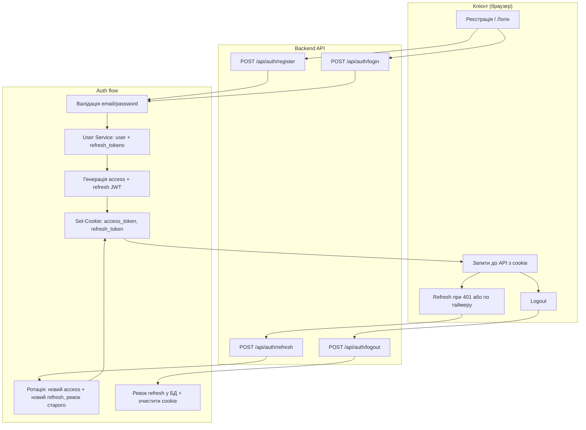

# Технічне завдання: Авторизація та User Service (Backend)

**Версія:** 1.1  
**Контекст:** Платформа вивчення німецької мови (MVP). База даних: PostgreSQL, ORM — на вибір реалізації.

---

## 1. Мета та область

### 1.1 Мета

Реалізувати на бекенді повний цикл авторизації:

- **Реєстрація** — створення user + профіль; успішна реєстрація **працює як логін**: одразу встановлюються access- та refresh-токени в cookie (клієнт не викликає login окремо).
- **Вхід (login)** — перевірка email + password, видача access- та refresh-токенів у **cookie**.
- **Оновлення сесії (refresh)** — ендпоінт за refresh-токеном з cookie видає **новий access** і **новий refresh** (ротація); обидва в cookie.
- **Вихід (logout)** — інвалідація refresh-токена в БД та очищення cookie.

Токени **не повертаються в тілі JSON** — тільки в **cookie**. Access token при захищених запитах можна також передавати через заголовок `Authorization: Bearer <token>` (fallback).

### 1.2 Токени

- **Access token** — JWT, TTL **30 хвилин**. Використовується для доступу до API; перевірка підпису та `exp`.
- **Refresh token** — **JWT**, TTL **7 днів**. Зберігається в БД (таблиця `refresh_tokens`) для можливості ревоку при logout; при валідації перевіряються підпис JWT, `exp` та відсутність ревоку в БД.

### 1.3 User Service

Один сервіс (модуль/пакет) **User Service** відповідає за:

- Створення та читання користувачів (users, student_profiles, teacher_profiles).
- Хешування та перевірка пароля (bcrypt).
- Генерація access JWT та refresh JWT.
- Збереження/читання/ревок записів refresh-токенів у БД (таблиця `refresh_tokens`).
- Витягування поточного користувача з access-токена для аутентифікації на захищених ендпоінтах (cookie або заголовок `Authorization: Bearer`).

Auth-ендпоінти використовують User Service всередині; зовні це лише HTTP API.

---

## 2. Модель даних (фрагмент)

Використовуються таблиці з `docs/architecture.md`:

- **users** — id (UUID), email (unique), password_hash, role (student | teacher), language (en | de), stripe_customer_id, deleted_at, created_at, updated_at.
- **refresh_tokens** — id, user_id (FK → users), token_hash (хеш рядка JWT refresh-токена для пошуку при ревоку), expires_at, revoked_at, created_at. При валідації refresh: перевірити підпис та exp JWT, потім знайти запис по token_hash (або по jti, якщо зберігати jti) і перевірити revoked_at.
- **student_profiles** / **teacher_profiles** — 1-1 з users за роллю.

Refresh JWT при збереженні в БД: зберігаємо **хеш** рядка JWT (наприклад SHA-256) у полі `token_hash`, щоб при logout за токеном з cookie знайти запис і встановити `revoked_at`. Альтернатива: зберігати в payload JWT claim `jti` (UUID) і в таблиці мати колонку `jti` UNIQUE; тоді ревок по jti.

---

## 3. Cookie

### 3.1 Назви та призначення

| Ім'я cookie     | Призначення | Хто встановлює |
|-----------------|-------------|-----------------|
| `access_token`  | JWT для доступу до API, TTL 30 хв | Backend (register, login, refresh) |
| `refresh_token` | JWT для отримання нової пари токенів, TTL 7 днів | Backend (register, login, refresh) |

### 3.2 Атрибути (фіксовано для MVP)

- **HttpOnly** — `true`.
- **Secure** — `true` у production (HTTPS).
- **SameSite** — `Lax` (фронт і API на **одному домені**).
- **Path** — **`/api`** (запити до бекенда йдуть під `/api`).
- **Max-Age:**
  - access_token: **1800** (30 хвилин, у секундах).
  - refresh_token: **604800** (7 днів).

Токени в response **не повертаються в JSON** — тільки в cookie. Клієнт відправляє cookie при запитах (credentials: include).

Детальні налаштування cookie та CORS винесені в **docs/auth-config.md**.

---

## 4. Ендпоінти

Базовий шлях: **`/api/auth`**.

### 4.1 Реєстрація (= логін після успіху)

**POST** `/api/auth/register`

**Призначення:** створити користувача (user + відповідний профіль). Успішна реєстрація **працює як логін**: встановлюються cookie з access_token та refresh_token, у тілі повертаються дані користувача. Окремий виклик login після реєстрації **не потрібен**.

**Request body (JSON):**

```json
{
  "email": "user@example.com",
  "password": "SecurePass1",
  "role": "student",
  "language": "de"
}
```

| Поле     | Тип   | Обов'язкове | Опис |
|----------|-------|-------------|------|
| email    | string| так         | Валідний email, унікальний у системі |
| password | string| так         | Мінімум **9 символів**, хоча б **одна велика літера**, хоча б **одна цифра** |
| role     | enum  | так         | `student` \| `teacher` |
| language | enum  | ні          | `en` \| `de`, за замовчуванням `en` |

**Успішна відповідь:** `201 Created`. Токени — **тільки в cookie** (access_token, refresh_token). Тіло:

```json
{
  "user": {
    "id": "uuid",
    "email": "user@example.com",
    "role": "student",
    "language": "de",
    "createdAt": "2025-01-15T12:00:00.000Z"
  }
}
```

**Помилки:**

- `400` — невалідні дані (email, пароль не відповідає вимогам, недопустима роль).
- `409 Conflict` — email вже зареєстрований.

**Логіка:**

1. Валідація body (email, password: мін. 9 символів, 1 велика літера, 1 цифра; role; language).
2. User Service: перевірка, що email не зайнятий.
3. User Service: хешування пароля (bcrypt), створення запису в `users`, створення запису в `student_profiles` або `teacher_profiles`.
4. User Service: генерація access JWT та refresh JWT; збереження refresh у `refresh_tokens` (token_hash або jti).
5. Встановити cookie `access_token`, `refresh_token` (Path=/api, HttpOnly, Secure, SameSite=Lax, Max-Age як вище).
6. Повернути 201 та JSON з об’єктом `user` (без токенів у тілі).

---

### 4.2 Вхід (Login)

**POST** `/api/auth/login`

**Призначення:** перевірити email + password, створити сесію: запис у `refresh_tokens`, встановити cookie з access- та refresh-токенами.

**Request body (JSON):**

```json
{
  "email": "user@example.com",
  "password": "SecurePass1"
}
```

**Успішна відповідь:** `200 OK`. Токени — тільки в cookie. Тіло:

```json
{
  "user": {
    "id": "uuid",
    "email": "user@example.com",
    "role": "student",
    "language": "de"
  }
}
```

**Помилки:**

- `400` — відсутній email або password.
- `401 Unauthorized` — невірний email або пароль.

**Логіка:** аналогічно реєстрації після створення user: знайти user за email, перевірити пароль, згенерувати access + refresh JWT, зберегти refresh у БД, встановити cookie, повернути 200 з `user`.

---

### 4.3 Оновлення токенів (Refresh) з ротацією

**POST** `/api/auth/refresh`

**Призначення:** за валідним refresh-токеном з cookie видати **новий access** і **новий refresh** (ротація); старий refresh ревокається. Токени повертаються лише в cookie.

**Request:** без body. Refresh-токен — у cookie `refresh_token`.

**Успішна відповідь:** `200 OK`. У cookie встановлюються **нові** access_token та refresh_token. Тіло:

```json
{
  "user": {
    "id": "uuid",
    "email": "user@example.com",
    "role": "student",
    "language": "de"
  }
}
```

**Помилки:**

- `401 Unauthorized` — cookie відсутня, JWT невалідний, прострочений або відкликаний.

**Логіка:**

1. Прочитати cookie `refresh_token`. Якщо немає — 401.
2. User Service: перевірити підпис та exp JWT; знайти запис у `refresh_tokens` (по token_hash або jti), перевірити revoked_at IS NULL.
3. Якщо невалідний або відкликаний — 401.
4. Згенерувати **новий** access JWT та **новий** refresh JWT; зберегти новий refresh у БД; встановити revoked_at для **старого** запису refresh.
5. Встановити cookie з новими access_token та refresh_token.
6. Повернути 200 та user.

---

### 4.4 Вихід (Logout)

**POST** `/api/auth/logout`

**Призначення:** інвалідувати поточний refresh-токен (revoked_at = now()) та очистити cookie.

**Request:** refresh_token у cookie. Тіло не потрібне.

**Успішна відповідь:** **`200 OK`** з порожнім тілом. Cookie `access_token` та `refresh_token` видаляються (Set-Cookie з Max-Age=0, Path=/api).

**Логіка:** прочитати refresh_token з cookie; знайти запис у `refresh_tokens`, встановити revoked_at = now(); надіслати відповідь з очищеними cookie.

---

## 5. User Service (контракт)

Сервіс оперує даними та БД; ендпоінти викликають його методи.

| Метод / операція | Опис |
|------------------|------|
| `findUserByEmail(email)` | Повернути user по email (або null), без password_hash для публічного використання. |
| `findUserById(id)` | Повернути user по id (після валідації access JWT). |
| `createUser({ email, password, role, language })` | Хешувати пароль (bcrypt), створити user + student_profiles/teacher_profiles; повернути user без password_hash. |
| `validatePassword(user, plainPassword)` | bcrypt compare; true/false. |
| `createRefreshToken(userId)` | Згенерувати refresh **JWT** (sub=user_id, jti, exp=7d), зберегти запис у refresh_tokens (token_hash від JWT рядка або jti); повернути рядок JWT. |
| `findValidRefreshToken(token)` | Перевірити підпис та exp JWT; знайти запис у refresh_tokens (по token_hash або jti), revoked_at IS NULL; повернути запис або null. |
| `revokeRefreshToken(token)` | Знайти запис по токену (hash/jti), встановити revoked_at = now(). |
| `revokeRefreshTokenById(id)` | За id запису встановити revoked_at. |

**Аутентифікація access:** витягнути токен з cookie `access_token` або з заголовка **`Authorization: Bearer <token>`** (fallback). Перевірити підпис та exp JWT, витягнути sub (user_id) → викликати `findUserById` і прикріпити user до запиту.

---

## 6. Діаграма авторизації (один flow)

Нижче — єдина діаграма: реєстрація (з автоматичним «логіном»), логін, оновлення токенів (refresh), вихід (logout).



**Пояснення:**

- **Реєстрація:** валідація → створення user + профіль → генерація access + refresh JWT → збереження refresh у БД → Set-Cookie → 201 + user.
- **Логін:** валідація → перевірка пароля → генерація access + refresh JWT → збереження refresh у БД → Set-Cookie → 200 + user.
- **Refresh:** читання refresh з cookie → перевірка JWT та запису в БД → ротація (новий access + новий refresh, старий refresh ревокається) → Set-Cookie з новими токенами → 200 + user.
- **Logout:** читання refresh з cookie → ревок у БД → видалення cookie (Max-Age=0) → 200.

Cookie: Path=/api, SameSite=Lax, HttpOnly, Secure (prod). Access TTL 30 хв, refresh TTL 7 днів.

---

## 7. Критерії прийняття

- **Реєстрація:** POST `/api/auth/register` створює user + профіль, **одразу встановлює** access_token та refresh_token в cookie, повертає 201 з `user`; при дублікаті email — 409. Пароль: мін. 9 символів, 1 велика літера, 1 цифра.
- **Логін:** POST `/api/auth/login` перевіряє email/password, створює запис у refresh_tokens, встановлює access_token та refresh_token в cookie (Path=/api, SameSite=Lax, HttpOnly, Secure), повертає 200 з `user`; при помилці — 401.
- **Refresh:** POST `/api/auth/refresh` при валідному refresh в cookie видає **новий** access і **новий** refresh (ротація), ревокає старий refresh, встановлює нові cookie, повертає 200 з user; без/невалідний refresh — 401.
- **Logout:** POST `/api/auth/logout` ревокає refresh у БД та очищає cookie; відповідь **200 OK** з порожнім тілом.
- Токени в JSON не повертаються; access можна передати також через `Authorization: Bearer`.
- Access = JWT, 30 хв; refresh = JWT, 7 днів; обидва зберігаються лише в cookie (окрім fallback для access).

---

## 8. Посилання

- Схема БД: **docs/architecture.md** (секція 3).
- Налаштування ENV, CORS (main.ts), cookie: **docs/auth-config.md**.
