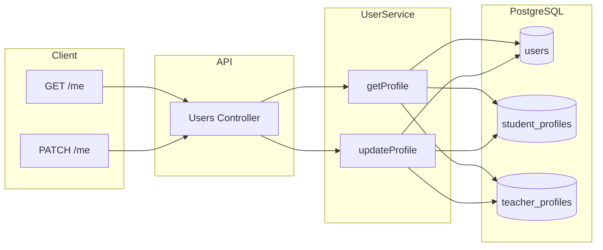

# Модуль: Users

Профіль **поточного** користувача. Не прив'язуємо студента до конкретного вчителя; тільки «я» (me).

---

## 1. Призначення

- Дати клієнту дані поточного користувача (після авторизації).
- Дозволити оновлення профілю: **студент** — timezone, language; **вчитель** — bio, is_active (і далі інші поля за потреби). **level** студент не змінює — він оновлюється автоматично в процесі навчання.
- Вчитель виступає як адміністратор контенту (курси, матеріали, запити на заняття); деталі — в модулях Courses, Course Materials, Lesson Requests.

---

## 2. Дані (таблиці БД)

| Таблиця | Операції |
|---------|----------|
| users | читання, оновлення (language тощо) |
| student_profiles | читання, оновлення (timezone; level тільки з інших модулів) |
| teacher_profiles | читання, оновлення (bio, is_active) |

---

## 3. Сервіс

**User Service** (спільний з Auth): вже надає `findUserById`, `findUserByEmail`. Для модуля Users додаються (або розширюються):

- Отримання профілю поточного користувача разом з відповідним профілем (student_profiles або teacher_profiles).
- Оновлення дозволених полів профілю за роллю (student: timezone, language в users; teacher: bio, is_active в teacher_profiles).

---

## 4. Ендпоінти (базові)

| Метод | Шлях | Опис | Роль |
|-------|------|------|------|
| GET | /api/users/me | Повернути поточного користувача та профіль (без password_hash). | авторизований |
| PATCH | /api/users/me | Оновити профіль: student — timezone, language; teacher — bio, is_active. Не дозволяти зміну level. | авторизований |

Детальні request/response та коди помилок — на етапі реалізації.

---

## 5. Діаграма

---

## 6. Примітки

- Публічний профіль іншого юзера (наприклад вчителя для студента) у MVP не потрібен — тільки поточний користувач.
- Зміна ролі та створення/редагування курсів і матеріалів — в модулях Auth та Courses / Course Materials.
