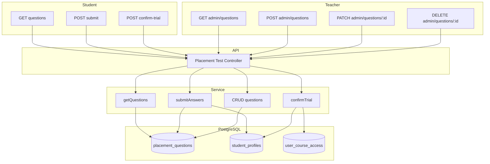

# Модуль: Placement Test

**Один** тест визначення рівня студента (A1–B2), без прив'язки до курсу. Збереження результату та активація trial після **підтвердження** користувачем пробного періоду.

---

## 1. Призначення

**Студент:**
- Отримати питання **одного** placement-тесту (з таблиці `placement_questions`, **не прив'язані до курсу**).
- Відправити відповіді; обчислити рівень **за кількістю правильних відповідей** (MVP); зберегти в `student_profiles.level`.
- Після підтвердження пробного періоду — створити запис **user_course_access** для **одного** курсу (наприклад рекомендованого за рівнем): access_type = trial, trial_ends_at = now() + N днів.

**Вчитель (адмін контенту):**
- Додавати, редагувати та видаляти питання placement-тесту (CRUD для `placement_questions`). Вчитель керує єдиним тестом визначення рівня.

**Тести в кінці курсів** (на підвищення рівня) реалізовані окремо — як матеріали курсу типу **quiz** (course_materials з course_id). Їх проходження та оновлення рівня — у модулі **Progress & Quizzes**.

---

## 2. Дані (таблиці БД)

| Таблиця | Операції |
|---------|----------|
| placement_questions | читання (студент + вчитель), створення, оновлення, видалення (вчитель) |
| student_profiles | читання, оновлення (level, trial_ends_at) |
| user_course_access | створення (при підтвердженні trial — один курс, access_type = trial, trial_ends_at) |
| placement_results | опціонально — історія проходжень placement (raw_score, level) |

---

## 3. Сервіс

**PlacementTestService** (або в складі User/Progress):

- Отримання списку питань для placement-тесту (для студента — публічний список; для вчителя — повний список для управління).
- **CRUD питань (вчитель):** створення, оновлення, видалення записів у placement_questions (question_data, level, order_index).
- Перевірка відповідей, підрахунок правильних, визначення рівня за правилами (діапазони балів → A1/A2/B1/B2).
- Збереження рівня в student_profiles; опціонально запис у placement_results.
- Активація trial: при підтвердженні користувачем — створити запис user_course_access для одного курсу (access_type = trial, trial_ends_at).

---

## 4. Ендпоінти (базові)

**Студент:**

| Метод | Шлях | Опис | Роль |
|-------|------|------|------|
| GET | /api/placement-test/questions | Повернути питання placement-тесту (для проходження). | студент |
| POST | /api/placement-test/submit | Відправити відповіді; обчислити рівень; зберегти в профілі; повернути результат (level). | студент |
| POST | /api/placement-test/confirm-trial | Підтвердити пробний період → створити запис trial. | студент |

**Вчитель (управління питаннями):**

| Метод | Шлях | Опис | Роль |
|-------|------|------|------|
| GET | /api/placement-test/admin/questions | Список усіх питань placement-тесту (для редагування). | teacher |
| POST | /api/placement-test/admin/questions | Додати питання (question_data, level, order_index). | teacher |
| PATCH | /api/placement-test/admin/questions/:id | Редагувати питання. | teacher |
| DELETE | /api/placement-test/admin/questions/:id | Видалити питання. | teacher |

Деталі request/response — на етапі реалізації.

---

## 5. Діаграма

---

## 6. Примітки

- Вчитель керує **одним** placement-тестом: додає, редагує, видаляє питання через admin-ендпоінти. Студент лише отримує список питань та відправляє відповіді.
- Цей модуль стосується **тільки** одного тесту визначення рівня (placement). Усі інші тести в системі прив'язані до курсу (course_materials типу quiz) — див. docs/architecture.md, секція «Тести в кінці курсів».
- Рівень визначається тільки за кількістю правильних (MVP); складність питань можна враховувати пізніше.
- Trial створюється лише після явного підтвердження (ендпоінт confirm-trial або аналог).
