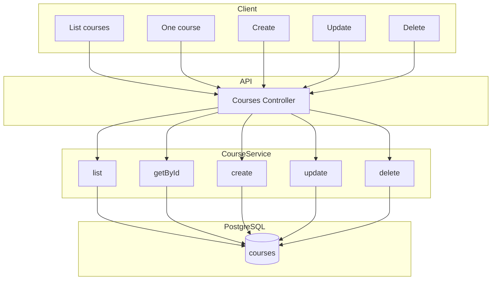

# Модуль: Courses

Курси платформи: створення/редагування вчителем, список курсів для студента. **MVP:** показуємо всі курси; фільтрацію за доступом/рівнем можна додати пізніше.

---

## 1. Призначення

- **Вчитель:** будь-який вчитель може **створювати, редагувати та видаляти будь-який курс** — курс не прив'язаний до конкретного вчителя; усі вчителі мають однаковий доступ до всіх курсів. Вчитель виступає як адмін контенту (модулі, матеріали — в модулі Course Materials).
- **Студент:** каталог — список усіх опублікованих курсів (для вибору та купівлі). Доступ до **контенту** курсу (матеріали, прогрес) — лише якщо є запис у **user_course_access** для цього курсу (trial, купівля або активна підписка на курс).
- Категорія курсу: `language` | `sociocultural` (Integration & Life in Germany). Фільтр за category/language — за потреби.

---

## 2. Дані (таблиці БД)

| Таблиця | Операції |
|---------|----------|
| courses | читання, створення, оновлення, видалення (будь-який вчитель — без обмеження «тільки власний») |

---

## 3. Сервіс

**CourseService:**

- Список курсів: опубліковані (is_published = true); опціонально фільтр за category, language. MVP — без прив'язки до рівня студента.
- Для вчителя: створення курсу, оновлення, видалення **будь-якого** курсу (обмеження за teacher_id не застосовується).
- Отримання одного курсу по id (для перегляду та для редагування матеріалів).

---

## 4. Ендпоінти (базові)

| Метод | Шлях | Опис | Роль |
|-------|------|------|------|
| GET | /api/courses | Каталог: список опублікованих курсів (фільтри за бажанням). | авторизований |
| GET | /api/courses/:id | Один курс по id (метадані). Перегляд матеріалів — окремо, з перевіркою user_course_access. | авторизований |
| GET | /api/courses/my | Курси, до яких у студента є доступ (user_course_access). | студент |
| POST | /api/courses | Створити курс. | teacher |
| PATCH | /api/courses/:id | Оновити **будь-який** курс. | teacher |
| DELETE | /api/courses/:id | Видалити **будь-який** курс. | teacher |

**Правило доступу:** курси продаються окремо. Каталог (GET /api/courses) показує всі опубліковані курси. Доступ до матеріалів курсу та GET /api/courses/:id/materials дозволений лише при наявності запису в **user_course_access** для (user_id, course_id) з активним trial (trial_ends_at > now()), купівлею або активною підпискою на цей курс. Модуль Subscriptions: купівля/підписка на курс, створення user_course_access.

Курси не прив'язані до конкретного вчителя: будь-який вчитель має однакові права створювати, редагувати та видаляти будь-який курс.

---

## 5. Діаграма

---

## 6. Примітки

- Курси спільні для всіх вчителів: жодного обмеження «тільки автор» або «тільки власний курс». У БД поле teacher_id (якщо є) може зберігати «хто створив» для історії, але не використовується для обмеження доступу.
- Доступ до контенту (підписка/trial) для MVP може бути м'якою. Деталі матеріалів — модуль Course Materials.
