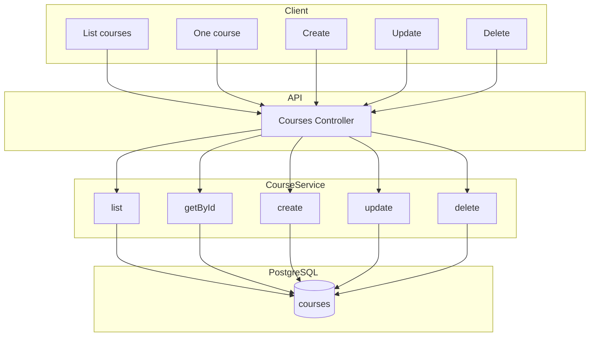

# Модуль: Courses

Курси платформи: створення/редагування вчителем, список курсів для студента. **MVP:** показуємо всі курси; фільтрацію за доступом/рівнем можна додати пізніше.

---

## 1. Призначення

- **Вчитель:** будь-який вчитель може **створювати, редагувати та видаляти будь-який курс** — курс не прив'язаний до конкретного вчителя; усі вчителі мають однаковий доступ до всіх курсів. Вчитель виступає як адмін контенту (модулі, матеріали — в модулі Course Materials).
- **Студент:** отримати список курсів (опублікованих) — **тільки за наявності активної підписки або пробного періоду (trial)** на платформі; без підписки/trial доступ до списку курсів не надається.
- Категорія курсу: `language` | `sociocultural` (Integration & Life in Germany). Фільтр за category/language — за потреби.

---

## 2. Дані (таблиці БД)

| Таблиця | Операції |
|---------|----------|
| courses | читання, створення, оновлення, видалення (будь-який вчитель — без обмеження «тільки власний») |

---

## 3. Сервіс

**CourseService:**

- Список курсів: опубліковані (is_published = true); опціонально фільтр за category, language. MVP — без прив'язки до рівня студента.
- Для вчителя: створення курсу, оновлення, видалення **будь-якого** курсу (обмеження за teacher_id не застосовується).
- Отримання одного курсу по id (для перегляду та для редагування матеріалів).

---

## 4. Ендпоінти (базові)

| Метод | Шлях | Опис | Роль |
|-------|------|------|------|
| GET | /api/courses | Список курсів (опублікованих; фільтри за бажанням). Доступ лише при активній підписці або trial. | студент (підписка або trial) |
| GET | /api/courses/:id | Один курс по id. | авторизований (підписка або trial — для студента) |
| POST | /api/courses | Створити курс. | teacher |
| PATCH | /api/courses/:id | Оновити **будь-який** курс. | teacher |
| DELETE | /api/courses/:id | Видалити **будь-який** курс. | teacher |

**Правило доступу:** список курсів (GET /api/courses) та перегляд курсу (GET /api/courses/:id) для студентів дозволені лише при **активній підписці** або **активному пробному періоді (trial)** на платформі; умови «підписка» та «trial» визначені в модулі Subscriptions.

Курси не прив'язані до конкретного вчителя: будь-який вчитель має однакові права створювати, редагувати та видаляти будь-який курс.

---

## 5. Діаграма

---

## 6. Примітки

- Курси спільні для всіх вчителів: жодного обмеження «тільки автор» або «тільки власний курс». У БД поле teacher_id (якщо є) може зберігати «хто створив» для історії, але не використовується для обмеження доступу.
- Доступ до контенту (підписка/trial) для MVP може бути м'якою. Деталі матеріалів — модуль Course Materials.
