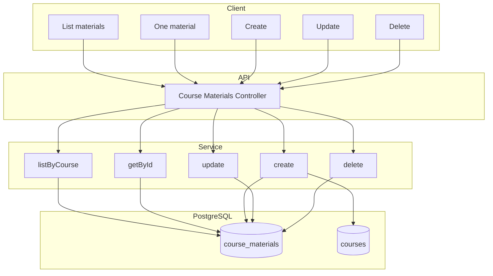

# Модуль: Course Materials

Матеріали курсу (відео, лексика, граматика, квіз, сценарій, культурна вставка, домашнє завдання тощо). CRUD — вчитель; читання — студент (з перевіркою доступу за потреби).

---

## 1. Призначення

- **Вчитель:** додавати, редагувати, видаляти матеріали курсу (лише своїх курсів). Типи: video, vocabulary, grammar, quiz, scenario, cultural_insight, homework, text.
- **Студент:** отримувати матеріали курсу для навчання (за order_index). Перевірка доступу: наявність запису в **user_course_access** для (user_id, course_id) з активним доступом (trial_ends_at > now(), купівля або активна підписка на курс).
- Один матеріал — в контексті курсу (GET /api/courses/:courseId/materials); окремий ендпоінт GET матеріалу по id для програвача/квізу — за потреби.

---

## 2. Дані (таблиці БД)

| Таблиця | Операції |
|---------|----------|
| course_materials | читання, створення, оновлення, видалення |
| courses | читання (будь-який вчитель може редагувати матеріали будь-якого курсу) |

---

## 3. Сервіс

**CourseMaterialService:**

- Список матеріалів курсу (за course_id, order_index).
- Один матеріал по id (з перевіркою, що курс опублікований / доступний).
- Створення/оновлення/видалення матеріалу для **будь-якого** курсу (обмеження за вчителем не застосовується).
- Валідація типу та content (для scenario — JSON з нодами/гілками).

---

## 4. Ендпоінти (базові)

| Метод | Шлях | Опис | Роль |
|-------|------|------|------|
| GET | /api/courses/:courseId/materials | Список матеріалів курсу (по порядку). | авторизований |
| GET | /api/courses/:courseId/materials/:id | Один матеріал (наприклад для відео/квізу). | авторизований |
| POST | /api/courses/:courseId/materials | Додати матеріал до будь-якого курсу. | teacher |
| PATCH | /api/courses/:courseId/materials/:id | Редагувати матеріал. | teacher |
| DELETE | /api/courses/:courseId/materials/:id | Видалити матеріал. | teacher |

Деталі request/response — на етапі реалізації.

---

## 5. Діаграма

---

## 6. Відео: хостинг (YouTube) та майбутній варіант (S3)

**Поточне рішення — YouTube.** Відео-матеріали (type = video) зберігаються на YouTube (рекомендовано unlisted для курсів). У полі `content` матеріалу зберігаємо ідентифікатор для вбудовування, наприклад: `{ "youtube_video_id": "dQw4w9WgXcQ" }`. Фронтенд показує відео через iframe або YouTube IFrame Player API. Переваги: нульова вартість хостингу, швидкий старт; недоліки — можлива реклама у вбудованому плеєрі, залежність від політик YouTube.

**Майбутній розвиток — як вирішити питання контролю та реклами.** Якщо з’явиться потреба у повному контролі над плеєром і відсутності реклами (наприклад, скарги студентів або вимоги партнерів), можливий перехід на власне зберігання: **S3-сумісний бакет + CDN**. Схема: відео-файли зберігаються в бакеті; у `content` зберігається `storage_key` (шлях до файлу); бекенд при `GET` матеріалу генерує тимчасовий signed URL і повертає його клієнту; плеєр використовує цей URL. Це дає повний контроль над контентом і відсутність сторонньої реклами. Рекомендується заздалегідь передбачити в структурі `content` підтримку обох варіантів (наприклад поле `video_source: "youtube" | "s3"` та відповідно `youtube_video_id` або `storage_key`), щоб зміна хостингу не вимагала зміни моделі даних.

---

## 7. Примітки

- Сценарії (type = scenario): content — JSON з нодами та гілками; збереження результату проходження — в модулі Progress & Quizzes.
- Прив'язка до рівня студента для MVP не обов'язкова (зафіксовано в architecture).
