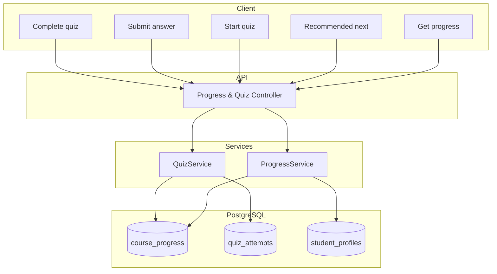

# Модуль: Progress & Quizzes

Прогрес по курсах і матеріалах; проходження квізів з **покроковим** збереженням відповідей (resume); рекомендований наступний крок — наступний курс за рівнем.

---

## 1. Призначення

- Зберігати прогрес: які матеріали/курси пройдені (course_progress); відсоток або бали за потреби.
- Квізи: **кожна відповідь зберігається окремо**, щоб при перериванні користувач не проходив квіз з початку (квіз може складатися з кількох блоків).
- Результати проходження квізів/сценаріїв (quiz_attempts: score, answers_snapshot або окремі записи по відповідях).
- Агрегація: завершені модулі, відсоток правильних, поточний рівень (з профілю).
- **Рекомендований наступний крок:** наступний курс за рівнем студента (логіка за level та course_progress).

Оновлення рівня студента (student_profiles.level) в процесі навчання — за правилами (наприклад після завершення курсу/тесту); деталі можна описати пізніше.

**Тести в кінці курсів** (на підвищення рівня) — це **course_materials** типу quiz, прив'язані до курсу (course_id). Їх проходження зберігається в quiz_attempts; після успішного проходження можна оновлювати student_profiles.level (див. docs/architecture.md, «Тести в кінці курсів»).

---

## 2. Дані (таблиці БД)

| Таблиця | Операції |
|---------|----------|
| course_progress | читання, створення, оновлення (completed_at, score) |
| quiz_attempts | читання, створення, оновлення (проміжні відповіді в answers_snapshot або окрема таблиця) |
| student_profiles | читання (level), оновлення (level — з цього модуля за правилами) |
| course_materials | читання (структура квізу для валідації відповідей) |

---

## 3. Сервіси

**ProgressService:**

- Отримання прогресу по курсу/користувачу (пройдені матеріали, відсоток).
- Позначити матеріал пройденим (або оновити запис course_progress).
- Рекомендований наступний крок: наступний курс за рівнем (на основі level та course_progress).

**QuizService** (або частина ProgressService):

- Почати спробу квізу (створити quiz_attempt без completed_at).
- Відправити одну відповідь (зберегти в answers_snapshot або в окрему таблицю; оновити прогрес спроби).
- Завершити квіз (completed_at, score); оновити course_progress за потреби.

---

## 4. Ендпоінти (базові)

| Метод | Шлях | Опис | Роль |
|-------|------|------|------|
| GET | /api/progress/me | Загальний прогрес: курси, відсотки, поточний рівень. | студент |
| GET | /api/courses/:courseId/progress | Прогрес по курсу (пройдені матеріали). | студент |
| POST | /api/courses/:courseId/materials/:materialId/complete | Позначити матеріал пройденим (або оновити course_progress). | студент |
| GET | /api/progress/recommended-next | Рекомендований наступний курс за рівнем. | студент |
| POST | /api/quiz/attempts | Почати спробу квізу (course_material_id). | студент |
| POST | /api/quiz/attempts/:attemptId/answers | Відправити одну відповідь (блок); зберегти для resume. | студент |
| POST | /api/quiz/attempts/:attemptId/complete | Завершити квіз (підрахунок score, completed_at). | студент |
| GET | /api/quiz/attempts/:attemptId | Отримати поточний стан спроби (для resume). | студент |

Деталі — на етапі реалізації.

---

## 5. Діаграма

---

## 6. Примітки

- Кожна відповідь квізу зберігається окремо (покроково), щоб можна було продовжити квіз після виходу.
- Рівень студента оновлюється в процесі навчання (не вручну); правила оновлення level — у цьому модулі або в Placement Test / після завершення модульних тестів.
