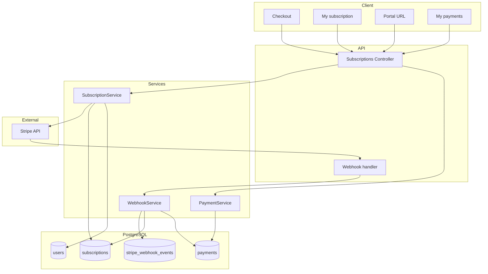

# Модуль: Subscriptions & Billing

Підписки через Stripe: створення Checkout Session, статус підписки, Customer Portal, історія платежів; обробка webhook Stripe (ідемпотентність).

---

## 1. Призначення

- **Checkout:** ендпоінт створює Stripe Checkout Session і повертає URL для редіректу користувача (помісячна підписка).
- **Поточний статус підписки:** GET поточної підписки користувача (active, trialing, past_due, canceled тощо).
- **Customer Portal:** ендпоінт повертає URL Stripe Customer Portal (best practice) для керування підпискою та платежами.
- **Історія платежів:** GET список платежів/інвойсів користувача.
- **Webhook:** POST /webhooks/stripe — прийняти події Stripe, перевірити signature, ідемпотентність (stripe_webhook_events), оновити subscriptions та payments.

---

## 2. Дані (таблиці БД)

| Таблиця | Операції |
|---------|----------|
| subscriptions | читання, створення, оновлення (з webhook) |
| payments | читання (історія), створення (з webhook) |
| users | читання, оновлення (stripe_customer_id) |
| stripe_webhook_events | створення (ідемпотентність), читання |

---

## 3. Сервіси

**SubscriptionService:**

- Створити Stripe Checkout Session (customer_id з users або створити нового), повернути URL.
- Отримати поточну підписку користувача (активна/trialing тощо).
- Згенерувати URL Stripe Customer Portal (best practice: Stripe Billing Portal).

**PaymentService** (або в складі SubscriptionService):

- Список платежів користувача (по user_id або subscription_id).

**WebhookService:**

- Верифікація signature Stripe.
- Ідемпотентність: INSERT stripe_webhook_events (stripe_event_id); при конфлікті — пропустити.
- Обробка: checkout.session.completed, invoice.paid, customer.subscription.updated, customer.subscription.deleted (оновлення subscriptions, створення payments).

---

## 4. Ендпоінти (базові)

| Метод | Шлях | Опис | Роль |
|-------|------|------|------|
| POST | /api/subscriptions/checkout | Створити Checkout Session, повернути URL для редіректу. | авторизований |
| GET | /api/subscriptions/me | Поточний статус підписки користувача. | авторизований |
| POST | /api/subscriptions/portal | Повернути URL Stripe Customer Portal (best practice). | авторизований |
| GET | /api/payments/me | Історія платежів/інвойсів користувача. | авторизований |
| POST | /webhooks/stripe | Обробка подій Stripe (signature, ідемпотентність, оновлення БД). | Stripe (no auth) |

---

## 5. Діаграма

---

## 6. Примітки

- Customer Portal — best practice (Stripe Hosted Billing Portal); не зберігаємо картки на нашому боці.
- Trial створюється в модулі Placement Test при підтвердженні; продовження після trial — через Checkout.
