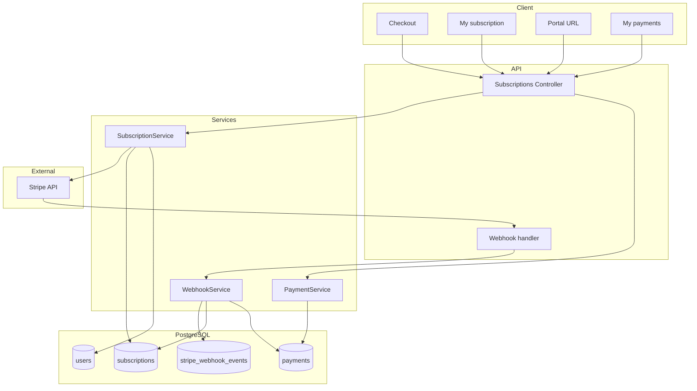

# Модуль: Subscriptions & Billing

**Курси продаються окремо.** Купівля або підписка на конкретний курс через Stripe: Checkout Session (з course_id), user_course_access, subscriptions (з course_id), payments; Customer Portal, webhook (ідемпотентність).

---

## 1. Призначення

- **Checkout:** ендпоінт приймає **course_id** і створює Stripe Checkout Session для купівлі/підписки на цей курс; повертає URL для редіректу. Після успішної оплати (webhook) — створення/оновлення **user_course_access** та subscription/payment (subscriptions.course_id, payments.course_id).
- **Мої підписки / доступ:** GET список курсів, до яких у користувача є доступ (user_course_access), або список підписок (subscriptions з course_id).
- **Customer Portal:** URL Stripe Customer Portal для керування підписками та платежами.
- **Історія платежів:** GET платежі користувача (з course_id для контексту).
- **Webhook:** POST /webhooks/stripe — верифікація signature, ідемпотентність (stripe_webhook_events), оновлення subscriptions, payments та **user_course_access**.

---

## 2. Дані (таблиці БД)

| Таблиця | Операції |
|---------|----------|
| user_course_access | читання, створення, оновлення (при checkout success, trial, webhook) |
| subscriptions | читання, створення, оновлення (з webhook); **course_id** обов'язковий |
| payments | читання (історія), створення (з webhook); **course_id** для купівлі курсу |
| users | читання, оновлення (stripe_customer_id) |
| stripe_webhook_events | створення (ідемпотентність), читання |

---

## 3. Сервіси

**SubscriptionService (або CourseAccessService):**

- Створити Stripe Checkout Session для **курсу** (course_id у тілі запиту або URL); metadata сесії містить course_id для webhook.
- Отримати список курсів, до яких у користувача є доступ (з user_course_access), або список активних підписок (subscriptions з course_id).
- Згенерувати URL Stripe Customer Portal.

**PaymentService:**

- Список платежів користувача (user_id; payments з course_id).

**WebhookService:**

- Верифікація signature; ідемпотентність через stripe_webhook_events.
- checkout.session.completed: створити/оновити subscription (з course_id з metadata), створити/оновити **user_course_access** для (user_id, course_id).
- invoice.paid: записати payment (course_id), оновити subscription.status.
- customer.subscription.updated/deleted: синхронізувати subscription; при deleted — оновити user_course_access (прибрати доступ по підписці).

---

## 4. Ендпоінти (базові)

| Метод | Шлях | Опис | Роль |
|-------|------|------|------|
| POST | /api/subscriptions/checkout | Створити Checkout Session для курсу (body: course_id). Повернути URL для редіректу. | авторизований |
| GET | /api/subscriptions/me або /api/courses/my | Список курсів, до яких є доступ (user_course_access), або список підписок з course_id. | авторизований |
| POST | /api/subscriptions/portal | Повернути URL Stripe Customer Portal. | авторизований |
| GET | /api/payments/me | Історія платежів (з course_id). | авторизований |
| POST | /webhooks/stripe | Обробка подій Stripe (signature, ідемпотентність, оновлення БД та user_course_access). | Stripe (no auth) |

---

## 5. Діаграма

---

## 6. Примітки

- Customer Portal — best practice (Stripe Hosted Billing Portal); не зберігаємо картки на нашому боці.
- Trial (доступ до одного курсу на обмежений період) створюється в модулі Placement Test при підтвердженні — запис у user_course_access. Продовження доступу після trial або доступ до інших курсів — через Checkout (купівля/підписка на курс).
