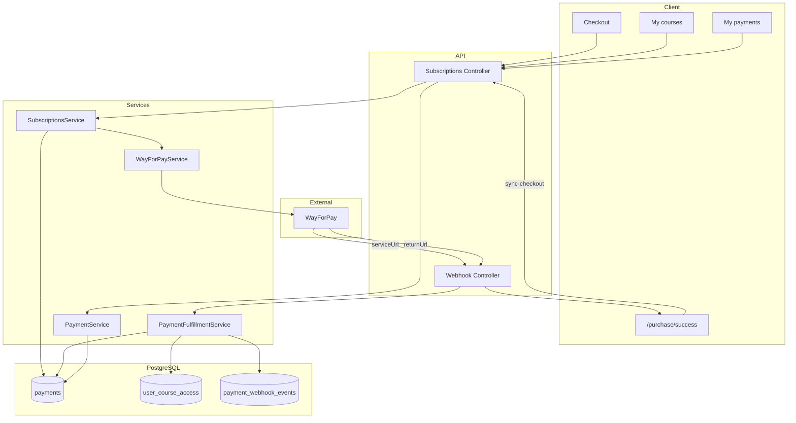

# Модуль: Subscriptions & Billing

**Курси продаються окремо, разовою оплатою через WayForPay.** Checkout створює платіжну сторінку
WayForPay (з course_id), а підтвердження оплати відкриває доступ у user_course_access.

> **Міграція зі Stripe.** Stripe більше не використовується. Історичні платежі лишаються в
> `payments` з `provider = "stripe"` і заповненим `stripe_invoice_id`; раніше видані доступи
> (`user_course_access`) продовжують працювати без змін. Підписок (`subscriptions`) MVP не створює —
> таблиця лишається лише для історичних записів.

---

## 1. Призначення

- **Checkout:** ендпоінт приймає **course_id**, створює `payments`-запис зі статусом `pending` і
  унікальним `order_reference`, після чого повертає URL платіжної сторінки WayForPay.
- **Webhook (serviceUrl):** `POST /api/webhooks/wayforpay` — перевірка HMAC-MD5 підпису,
  ідемпотентність (`payment_webhook_events`), позначення платежу оплаченим і створення
  **user_course_access** з `access_type = purchase`.
- **Return URL:** `POST/GET /api/webhooks/wayforpay/return` — WayForPay повертає браузер клієнта
  POST-запитом, backend редіректить на `${CORS_ORIGIN}/purchase/success?orderReference=...`.
- **Sync checkout:** `POST /api/subscriptions/sync-checkout` — запасний шлях, коли студент повернувся
  раніше за callback: backend робить `CHECK_STATUS` у WayForPay і за потреби відкриває доступ.
- **Мої курси:** GET список доступів (user_course_access).
- **Історія платежів:** GET платежі користувача (з `provider` та `order_reference`).

---

## 2. Дані (таблиці БД)

| Таблиця | Операції |
|---------|----------|
| user_course_access | читання, створення, оновлення (checkout success, trial) |
| payments | створення (`pending` при checkout), оновлення (`paid` / `failed`), читання (історія) |
| payment_webhook_events | створення (ідемпотентність callback-ів), читання |
| subscriptions, stripe_webhook_events | лише історичні дані, не записуються |

Ключові поля `payments`: `provider` (`wayforpay` / `stripe`), `order_reference` (унікальний,
WayForPay), `stripe_invoice_id` (унікальний, історичний), `status` (`pending` → `paid` / `failed`).

---

## 3. Сервіси

**WayForPayService** — інтеграційний шар без доступу до БД:

- підписи HMAC-MD5 для Purchase, CHECK_STATUS і accept-відповіді;
- створення платіжної сторінки (`/pay?behavior=offline` → JSON з `url`);
- перевірка підпису вхідного callback;
- `CHECK_STATUS` для ручної синхронізації.

**SubscriptionsService** — перевіряє курс (опублікований, має уроки, має ціну) і доступ
(`purchase`/`subscription` → 409, `trial` не блокує), створює pending-платіж і платіжну сторінку;
`syncCheckout` звіряє статус.

**PaymentFulfillmentService** — спільна для webhook і sync логіка: позначити платіж оплаченим і
відкрити доступ. Ідемпотентна.

**WebhookService** — нормалізує тіло callback (JSON / form-urlencoded / text/plain), перевіряє підпис,
захищає від повторів через `payment_webhook_events` і повертає підписану accept-відповідь.

**PaymentService** — список платежів користувача.

---

## 4. Ендпоінти

| Метод | Шлях | Опис | Роль |
|-------|------|------|------|
| POST | /api/subscriptions/checkout | Створити оплату курсу (body: `course_id`). Повертає `url` і `order_reference`. | авторизований |
| POST | /api/subscriptions/sync-checkout | Звірити статус оплати (body: `order_reference`). | авторизований |
| GET | /api/subscriptions/me | Список курсів, до яких є доступ. | авторизований |
| GET | /api/payments/me | Історія платежів. | авторизований |
| POST | /api/webhooks/wayforpay | serviceUrl-callback WayForPay. | WayForPay (no auth) |
| POST, GET | /api/webhooks/wayforpay/return | Повернення браузера клієнта → редірект на фронтенд. | публічний |

---

## 5. Діаграма

```mermaid
flowchart TB
    subgraph Client
        Ch[Checkout]
        Ret["/purchase/success"]
        Me[My courses]
        Pay[My payments]
    end

    subgraph API
        Ctrl[Subscriptions Controller]
        Wh[Webhook Controller]
    end

    subgraph Services
        SubS[SubscriptionsService]
        WfpS[WayForPayService]
        FulS[PaymentFulfillmentService]
        PayS[PaymentService]
    end

    subgraph External
        WFP[WayForPay]
    end

    subgraph DB["PostgreSQL"]
        PayT[(payments)]
        Acc[(user_course_access)]
        Ev[(payment_webhook_events)]
    end

    Ch --> Ctrl --> SubS
    SubS --> WfpS --> WFP
    SubS --> PayT
    WFP -- serviceUrl --> Wh --> FulS
    FulS --> Ev
    FulS --> PayT
    FulS --> Acc
    WFP -- returnUrl --> Wh --> Ret
    Ret -- sync-checkout --> Ctrl
    Me --> Ctrl
    Pay --> Ctrl --> PayS --> PayT
```

---

## 6. Примітки

- Ціна курсу зберігається в `courses.price`; валюта — `WAYFORPAY_CURRENCY` (за замовчуванням `EUR`).
- Купити можна лише опублікований курс, у якого є щонайменше один урок і задана ціна.
- Trial створюється в модулі Placement Test; після оплати доступ оновлюється на `purchase`,
  а `trial_ends_at` скидається.
- Без підписаної accept-відповіді WayForPay повторює callback кілька діб, тому webhook завжди
  повертає `{ orderReference, status: "accept", time, signature }`.
- Дані карток на нашому боці не зберігаються — оплата відбувається на стороні WayForPay.
