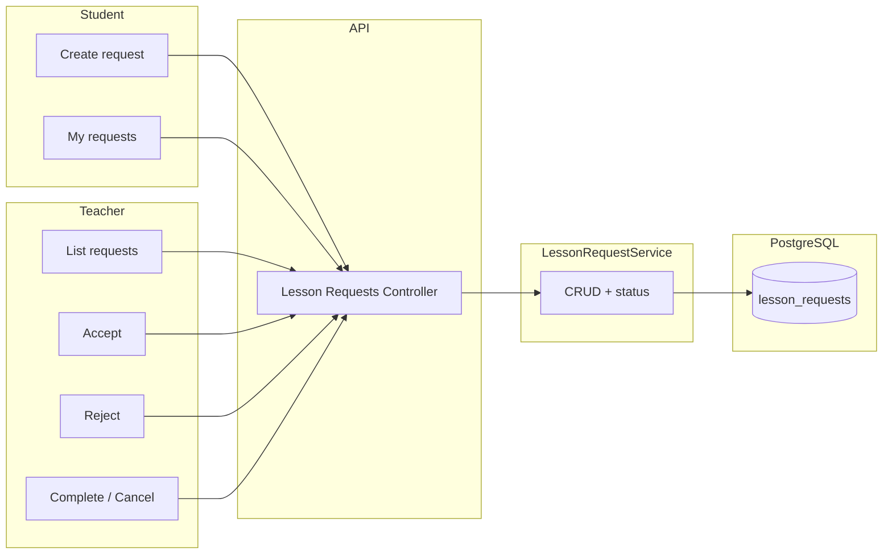

# Модуль: Lesson Requests

Запити на заняття: студент створює запит; **вчитель** приймає або відхиляє, далі виставляє статус заняття (completed / rejected). Після прийняття вчитель зв'язується з користувачем поза платформою.

---

## 1. Призначення

- **Студент:** створити запит на заняття (preferred_time, message). Переглянути свої запити та їх статуси.
- **Вчитель:** список запитів (pending та прийняті ним); прийняти запит (accepted, teacher_id = current user) або відхилити (rejected); для прийнятих — виставити статус заняття: completed або rejected (відхилено вже після прийняття, наприклад не відбулось).

Статуси: `pending` → вчитель приймає (`accepted`) або одразу відхиляє (`rejected`) → якщо accepted, вчитель пізніше виставляє `completed` або `rejected`.

---

## 2. Дані (таблиці БД)

| Таблиця | Операції |
|---------|----------|
| lesson_requests | читання, створення, оновлення (status, teacher_id) |

Поля: student_id, teacher_id (nullable), preferred_time, message, status (pending | accepted | completed | rejected).

---

## 3. Сервіс

**LessonRequestService:**

- Студент: створити запит; отримати свої запити.
- Вчитель: список запитів (наприклад усі pending + прийняті поточним вчителем); прийняти (accepted, teacher_id); відхилити (rejected); виставити completed/rejected для прийнятого.

---

## 4. Ендпоінти (базові)

| Метод | Шлях | Опис | Роль |
|-------|------|------|------|
| POST | /api/lesson-requests | Створити запит (preferred_time, message). | студент |
| GET | /api/lesson-requests/me | Мої запити (студент — свої; вчитель — для нього доступні). | авторизований |
| PATCH | /api/lesson-requests/:id/accept | Прийняти запит (teacher_id, status = accepted). | teacher |
| PATCH | /api/lesson-requests/:id/reject | Відхилити запит (status = rejected). | teacher |
| PATCH | /api/lesson-requests/:id/complete | Виставити заняття пройденим (status = completed). | teacher |
| PATCH | /api/lesson-requests/:id/cancel | Відхилити після прийняття (status = rejected). | teacher |

Можна об'єднати complete/cancel в один PATCH з тілом { status: "completed" | "rejected" }. Деталі — на етапі реалізації.

---

## 5. Діаграма

---

## 6. Примітки

- Після прийняття (accepted) вчитель зв'язується зі студентом поза платформою; календар/відеозв'язок у MVP не реалізуємо.
- Статус completed/rejected виставляє вчитель після проведення (або скасування) заняття.
